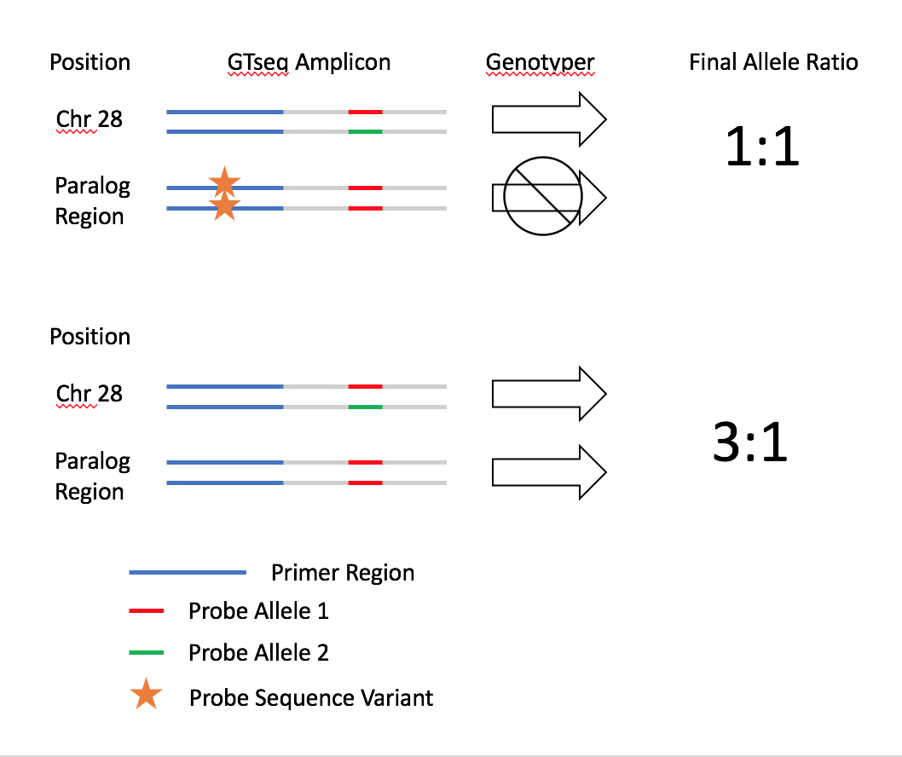

```{r, message=FALSE, warning=FALSE}
require(tidyverse)
require(DiagrammeR)
require(poppr)
require(genepop)
require(graph4lg)
require(related)
require(adegenet)
require(knitr)
require(magrittr)
```


# Readme

This is document is an R notebook. If you’d like view to pre-rendered figures, read a summary of analysis and interact with code, please open the relevant html file in a browser.

To conduct a similar analyses on your computer, edit or run code: clone this repository into a directory on you r local machine and open the .Rproj file in Rstudio.

This repository is available at https://github.com/david-dayan/coastal_chinook_75bp_test

# Goals / Outline

This notebook details panel quality control for the 75bp Chinook GTseq panel. 

__Specific Goals:__  
(1) Look for failed primers (extremely low reads across all samples)  
(2) look for read hogs (over amplifying primers)  
(3) primer specificity  
(4) probe specificity  
(5) dimer formation  
(6) New Markers  

With respect to goal (6), the input data includes samples prepared with and without the additional of several new test markers tagging the RoSA on Ots28. We will compare the panel performance with and without these markers.

__Approach__  
Goals above can mostly be accomplished by pooling all the reads from the test run into a single fastq, hashing the file, then running some included optimization scripts from the gtseq pipeline. I split the data into two sets: samples prepared with the Ots355 primers  and those prepared with the Ots355+RoSA primers and run the analyses below on each. 

(a) GTseq_SeqTest  
The GTseq_SeqTest script searches for unique (exact) occurences of each primer and  probe, and when both occur together. This can be used to identify low primer specificity (high ratio of probe:primer) or low probe specificity (high ratio of primer:probe). We can also look at the distribution of reads to identify any read hogs, or estimate if any poorly amplifying markers can be resuced with the increased depth from removing read hogs/reducing their primer concentration. I couldn't get this script to run correctly, after a few tries, so instead wrote a script employing awk and seqkit to achieve a similar goal (count primer and probe sequences).

(b) Genotyping  
We can run the genotyping script and then look for paralogs, and adjust allele correction values or change in silico probe length to increase specificity to avoid paralogs. Similarly, we can look for loci with non-normal distributions of reads across individuals to attempt to identify if primer or probe sequences occur over common variants. We can "rescue" these markers by shortening the in-silico primer or probe sequences to avoid the variant, but then this new in silico primer/probe needs to be tested again for specificity.

(c) GTseq_Primer-Interaction-Test  
This script looks for the reverse complement of the reverse primer sequence in off target reads, thereby identifying reads that formed from primer-dimers. it runs off the hash file. 

# Data Summary

__Samples__ 

Two sets of samples were independently prepared, set A (OtsCoastal2020_PT1) and set B (OtsCoastal2020_PT3). Populations and sample sizes are summarized in the table below

```{r, message=FALSE, warning=FALSE}
#read metadata
meta_data <- read_csv("metadata/CoastalChinook_Run017_Metadata.csv")

#clean this up
meta_data %<>% 
  mutate(DateSampled = as.Date(DateSampled, format = "%m/%d/%Y")) %>%
  rename(sample = `Individual Name`, date = DateSampled, sex = Gender, marks = Marks, location = IndividualSampleLOCATION ) %>%
  mutate(pop = str_sub(Pedigree, 8, 11)) %>%
  select(sample, pop, date, sex, marks, location)

#summarize
kable(meta_data %>%
        group_by(pop) %>%
        tally() %>%
        ungroup())
```


__Panels__  

Each set of samples was run twice: once with the new 75bp Chinook panel (referred to as OtsGTseqV6.1 at CRITFC) and once with this panel + additional Ots28 markers tagging the RoSA developed by SWFSC. 

Primers from OtsGTseqV6.1 were sent in an aliquot and contained all 351 markers. The RoSA markers include 7 markers individually spiked into library prep, however 2 were excluded: Ots37124-12270118 interacted with Ots_103122-180 (from OtsGTseqV6.1) in previous tests, however, the primers from OtsGTseqV6.1 were sent in a pre-mixed aliquot so Ots_103122-180 could not be excluded, and Ots37124-12270118 was excluded from the spike-in instead. The second excluded RoSA marker was Ots37124_12279142, as it is a duplicate with a marker in OtsGTseqV6.1. 

The total panel size for the OtsGTseqV6.1 + RoSA markers then is 356 (351 + 7 - 2). For short i refer to OtsGTseqV6.1 panel alone as Ots351, and OtsGTseqV6.1 + RoSA as Ots356

Panels are split by library prep plate. OtsGTseqV6.1 panel alone (Ots351) plates are plate11 (i7 sequence:CGGATG) and plate13 (i7 sequence:AACTTA). OtsGTseqV6.1+RoSA panel (Ots356) plates are plate 12 (i7 sequence:AATGTC) and 14 (i7 sequence:ACCGGA).

__Sequencing data__

Did not examine read quality for this project. Reads are available at ../../../dayan/coastal_chinook_2020/75bp_panel_qc/raw_reads

# OtsGTseqV6.1

First we separate the sample fastqs into those using OtsGTseqV6.1 primers form those using OtsGTseqV6.1+RoSA primers. This section deals with only samples genotyped at the OtsGTseqV6.1 markers, for OtsGTseqV6.1+RoSA marker samples see the relevant section below.

## Data Prep

First let's split into Ots351 and Ots356 files.
```{bash, eval = FALSE}
# separate reads into groups by i7 sequence
# the four i7 sequences used here are not also used as i5 sequences, so we can do this with some simple filename matching

#from raw_seqs dir
mkdir Ots351
mkdir Ots356
find ./ -iname "*CGGATG*" -print0 | xargs -0 -I {} mv {} Ots351
find ./ -iname "*AACTTA*" -print0 | xargs -0 -I {} mv {} Ots351

find ./ -iname "*AATGTC*" -print0 | xargs -0 -I {} mv {} Ots356
find ./ -iname "*ACCGGA*" -print0 | xargs -0 -I {} mv {} Ots356


#also let's move the late-summer run rogue steelhead files (in same sequencing run)
find ./ -iname "*CGGATG*" -print0 | xargs -0 -I {} mv {} Ots351


```

Now we'll decompress these files
```{bash, eval = FALSE}
#note this is run in each directory

#!/bin/bash
#$ -S /bin/bash
#$ -t 1-194
#$ -tc 30
#$ -N decompress_fastqs
#$ -cwd
#$ -o $JOB_NAME_$TASK_ID.out
#$ -e $JOB_NAME_$TASK_ID.err

FASTQS=(`ls -1 *fastq.gz`)
INFILE=${FASTQS[$SGE_TASK_ID -1]}

gunzip -c $INFILE > ./${INFILE%.gz}

#save this code chunk as a file on the server and submit this with qsub -q harold scriptname from the directory you want the output .genos files
```

Finally we'll build the hash files which we will use throughout this notebook 

```{bash, eval = FALSE}

# in each raw_reads subdirectory
# first merge all sample reads into a single file
cat *fastq > ../merged_Ots351.fasta
cat *fastq > ../merged_Ots356.fasta

#run hash (did with interactive shell (qrsh))
perl /dfs/Omalley_Lab/dayan/software/GTseq-Pipeline/GTseq_HashSeqs.pl merged_Ots351.fasta > merged_Ots351_hash.txt

perl /dfs/Omalley_Lab/dayan/software/GTseq-Pipeline/GTseq_HashSeqs.pl merged_Ots356.fasta > merged_Ots356_hash.txt

# rm the merged files (very big and same data already copied many times)

```

## SeqTest

The GTSeqTest script (from the gtseq pipeline) performs an exact matching search among the hash of reads from the test panel for (1) primer sequences, (2) probe sequences and (3) both 1 and 2 together in the same read. I have had some strange results when attempting to use this script in the past so wrote a different approach using seqkit and awk.

### Prep

First some prep. Need to make a list of probe sequences, with reverse complements. 
```{r, warning=FALSE, message=FALSE}
# Collect the primer and probe sequences from the OtsGTseqv6.1 summary files and saved as Ots351_probeseqs.txt


panel_info <- readxl::read_xlsx("metadata/Ots Loci Information. BPA. IDT. PROBEseq 1Feb2021.xlsx", sheet = 2)
Ots351_probes <- select(panel_info, `A1-Probe`, `A2-Probe`, `FWD Primer`)

Ots351_probes %<>%
  mutate(probe1 = case_when(
    str_detect(`A1-Probe`, pattern = "\\[") == TRUE ~ str_replace(`A1-Probe`, "([ATCG]*)\\[([ATCG])([ATCG])\\]([ATCG]*)", "\\1\\2\\4,\\1\\3\\4"  ),
    TRUE ~ `A1-Probe`)) %>%
  mutate(probe2 = case_when(
    str_detect(`A2-Probe`, pattern = "\\[") == TRUE ~ str_replace(`A2-Probe`, "([ATCG]*)\\[([ATCG])([ATCG])\\]([ATCG]*)", "\\1\\2\\4,\\1\\3\\4"  ),
    TRUE ~ `A2-Probe`))
    

#this (above) broke for a few markers when there were multiple base ambiguities in the probes, went in a text editor and just did these manually
#write_tsv(Ots351_probes, file = "metadata/Ots351_probes_for_awk.txt")

Ots351_probes <- read_tsv("metadata/Ots351_probes_for_awk.txt")

#reverse complement the probe sequences and combine into string in new column
Ots351_probes %<>%
  separate(probe1, c("probe1a","probe1b","probe1c","probe1d")) %>%
  separate(probe2, c("probe2a","probe2b","probe2c","probe2d")) %>%
  mutate(across(.cols=starts_with("probe"), .fns = insect::rc, .names = "{.col}_rc"))


Ots351_probes <- Ots351_probes %>%
  unite("probes_for_awk", probe1a:probe2d_rc, sep = ",", na.rm = TRUE, remove = FALSE)

#write_tsv(Ots351_probes, file = "metadata/Ots351_probes_for_awk2.txt")

#use this infor to build the functions below
```

### Seqtest Scripts
Now we count primer hits in the hash file
```{bash, eval = FALSE}

#!/bin/bash
#$ -S /bin/bash
#$ -N primer_count
#$ -cwd
#$ -o $JOB_NAME.out
#$ -e $JOB_NAME.err

PRIMERS="GGTCTTGCAGTCAGGAGAGG
AACCCTATGGGAACTCGTAGAACT
TGCCGCTGGATTTATTGACA
GTATAAACTAGAGTCCAGTGTTATGTTAATGTCTT
GCATTACTAAAAACTGGTGTGTGGAA
GCCTACCAGAAAGTACCAATTGTGA
GCCCTGGAGAAGTACGTTTTAAACTAA
CTGCATGAACGTTAACTCAAATAAAAGGT
TGCAGGAAGAGTTCAGAGAAATCT
AGACAATCATGGTGTTTTGAGTCTTTCT
CAAAGTGCAGGTGCTGGC
TGCAGGCATCATGCTTAATAACT
TGCAGTGCTGAATTAGAGATTAATTTTTGTG
CATTCCATGACAATGATTGAAATCTAAAAACAC
CGTGGAGTAGGTGGTTACAGTTTAT
GGATGGTTGTCATTTCTCTGCAAA
GGTGATTTTGCCACAGAGTAGAGAT
CACTAAATATTCCTTATCATTTCATACTAAGTCTGAAGAA
CGCGAGTTAGCTCGAATATTATGATTTC
GCAGGGCGCAAAGTTCTT
CAGATGAAAAATAAATAATTGGGCCATTAGGAA
GCATGTAACACATTATTTGGCATATGTACT
CCTTTTTCTTATTAGTTTTACTTCCCCAGAGA
GAAAAAGTAAAGTAAAAGTAAAGTATTATACCACTAAAGACAAT
GCCATGGAGGACTGGATGA
CAAGGGATGTGACAAATTAATCAAACACATAA
GTTTGGCTATTGAAATTATACATTAAAACATGTAGCT
CCGTTGCAGGACTCATCAGT
TGTCATCTCTATTGCAATCTCAGTAGATTTCTAT
TGCCATCATAAACAACCTAACAAGTAACT
TGGAGAACTTGCACTGAATGTGAAA
GCCTACTGATAAATGTATGACAGTAATGGA
CAGGTCTGGTCTACATCGAACAC
TCAAAGACATCGAACACAAGAACGA
AGTTGTTCTTTTTATATTGTGTTTTTATTCCATTCCA
GTTGGCTCCTTCAATTCAATTTGGA
AGCTAGGCTGTAAATGCAAGGAT
TTGTGGAATTACACCTTCAGAGTTCAAT
CATTTCCACGAAAAGCCAGATGAC
TTTTCTAGGACAGGTTGCTTGCA
GTCAACAAATGCAGGTAACATAAATGGT
TGAAATAAATTGTTCTGTTGATATGTGAATTTTGGA
TTTTAAAAATGGAGATAAACTCCTGACCTGAA
TGAGCGAGATTTATCAAACTGTCAAAGA
TGCAGGGTTGGGGACAATT
CAGATGATAGCTTCAGTAAGTGGTTCA
GGTAGGCCGTCAGTGTAAAATAAGT
AGTACAAGTGCAGAGAATGACATCATG
CACTTTTGACTTTACATGGAACTTAACTCAT
TGGGACAGAGGTGGGAATTGA
GTGTGTGTGTGTGTGTGTCATCGT
GTCGTTTTTCATAGAAAATAGCTCACAGTT
TGCAGGTGGGACTTAAACACA
TGCAGGACCAACTTTCTCAT
TGCAGGAGAGCAGGGTAGA
TCTCCTGAACTAATTTAGACCTCTGAATGT
TTTGTGCGTAAAGTCAGGTAGTGT
GCCGAAAAATAAGCGATTAGTGATGA
TGCCACCTCAGTTTTAGTGTTATATCC
CATAGTATAGTGATTCGAGTCTGGAGTCT
CACAGGAAGGACGTGTTTTGATG
GCAGGGGCAGACTGAAGG
GATCATTTATCAAGACTATAGGCTATGGATACG
TGCATCCATTCATACCTGACCAATT
CACTTGTTCTGCACACTACTTGTC
GCCTAGGTATGTACGAAACTTCACA
GGTGAGCCATTCATAACAATCTT
GAGGATGGATGAGACTTTTCAGAT
AAACCACGGTATCCTTTATTCATC
GGCTTGCCTTTAGATAGAATCTTG
GGCTTTCTGATGATCTTGAACTTT
CCCTCCAAAAAGAAAACATTTGAT
AGATGATATGGATTTGCTGTGTGT
AACACAGATCAAATGTTTTCACAC
TGAGGTATTACTTGCTGAGTTTGC
GCGAGTGTTAAAAGGGTCAAA
AGCGAGGCTTGCGTTTTACT
AAGGCCGTGAACATCTGTG
GCGGTGGGATACCTCCTCTA
GCAATTACCCATGACTCTGTGA
CATTTAGCAGACACTCTTATCTTAGTGTCA
GTCACGATCAGCAATGAGACAG
ATAATGTTTCCTGACATGTTGGTG
GAAGAGTCATGTCAGGATTAGCC
CTAGTCCTGACATGTAGGCTCATC
ACTCCTGGACATTCTGTGGTG
AAAATAAACAGAATGGAGTACCATGA
CAGGTCTCTCCAGAGATGTTTGAT
TAGTCCCACTGTACATGCCTTAGA
CCCAAGTGGTGAGTGTCAGT
GACTCAGGTAAGGAAACATCAATGTCA
TCATAAACATGGTGTCTTTCAGTCAGTT
TCGCTAGGCAGAAATATAGGGTTCT
CCTGAACAGGTACACACAAACGA
CTACGCGAGAAATAACACTTTTCAAAACT
GTGGGTAATCGATGCCAAAGAGAT
TGTTTTTGGTCATGTATTTTCTCTGCTATTTTT
CCTGAGCATCCCAGTTGAACT
GCGTTACTGGTGTTATAAACGTTAGC
GTTCTTTTTAATGATGACTACAGGTCTTTCAC
CCTGGTCTGTTTGTGATCAAGATG
CTGAGCTTTTTCAACTTACTTGTTGGA
CTCGCCTCTGTCATTGTATTACCTT
TTGTTCAATGGGCATTAATGCATGTT
GCCCTTGTGACAATGCACTGTTATA
ATCCAAGGAGCCCCATTAAAGATTT
AGAGCATTCAATTTAAAAGCTGAAAACGA
CTGCTGGCGCAGACATG
CATGTTACCCAGCTAAAAGTCTATAGCA
GTTCGTGGGATTGTTCAATGTTCAT
GGCCACTGTCATAGAATTAGGCATT
GCAGGGACAGGGCCCT
GCTCTTGCCCATCTGTAGGAT
CACTGAACTGTAAGCCATTGTGATT
GGAAACCAGCTAGGATTCAGGAA
TGCTTCAGTGAAAATAAGCGTGAGA
AGTCAGTGTTGGTGTAGTGAAGAGA
CAATTACTCTTTCTCAGCCCTGTGT
ATGGGTTGGGATTATGGTTCATTGT
GGAGGTGTAGTGAAATGGGAAGAT
TGCAGGAACTTGCTATGCT
GGAGAACATGCATCACCATTCAAG
TGCAGTTACAAGCCTAAGACAATCT
CGTGTCCGGCTTCTTTTATTTCATT
CCGTCTGAGTAGGAGGATCAATACA
GGAGGCTCTACGTAGGCCT
GAGGTTTGTTACTGTCACCCATAGA
GGGCCACGGGGTTGTAAA
GGACAAGTTGAAACAGATCAGGAAGT
ACTCTCCCAGAAGGATTCAGAGA
GCTGACCACCGACCACAG
AATATTGGCTTTCTGAGAATGCATTTGG
TCTGAACTCACCAAAGGAACACTTG
TGTGTACATCCGCGTAAATATTGAAGATAA
GAGACAAAGGTTTGCAGGTTCATG
TGGTGAGAGCAGCTTTAAATGTCTT
ACTGCAGGCGTCATGCTT
TGATTGTCTCATGGCCAATTGTCA
TGACAGATTTCACCTTTAACTAGCTAAGC
GCAGGGAAAACTGGTCAGGA
TCTTTGATATTGAGCTCATAAAAGCAAGGT
GTCTCTCTCTCTTTGCATCATTACACT
TGCGCGTCTCATTCAACCAT
TGTTGTCTCGGACTGCATGAC
GGATGACTCCTACTAATAGACGGATGT
CTCTTGCTACTTGCAGTGTATCTCA
GGTTGCAGGGCAGAACTGT
CCTATTTTTGATAGGTCATAGTGAATGGGATAG
TGCAGGGACGGGGCT
GCTGTGATTGTGCTCTAAAGACATG
TGCAGGAGCTGTGATGGG
CAGGAACCTGCTTTAATGCTCT
CCTTCAAACTAACACATCATAGACATGCTT
TGCCGTGAGAAACTGGTCA
ACTTCTTGAGCCAATCGGATGATG
CTTTTCTGAATTAGTGCTGTGCTTGT
TGGGATAGAACAGGAGCTTAAACA
GTGACAGGAGACAGAAAGAGACATT
AATGGGTAACAAAGAAATAGCTAGCTACTT
ATGTCAATATATTTCACTATAATGATTGGAAGCCA
CCGACGCCTCACTGAGT
CGGTCATTGTAAATGTCAACGGTTT
GCTGAGGAAGGATTCTGTATTTGCT
ACTCTATCATCGGCAGGACCAT
TCAATGTTCATCAATGCACTTCCTGTA
GCCCTGCCTGCAACTTC
TGTTGTAATCTTTCTGAATATTTGCTTGCTT
CTCACTGCAAATCCAACTTCATCAT
GGTCTGTCTGTCTGTCTATCTGTCAATG
AGTGCAGGTCTCCAGATTTACA
GAGTGGTCAAGGTTTCAGTTTCTG
TTCCCTAATCTGACGTACTACCAACT
CTGGTCTGTGACGTCAAAATGATG
GTGATGAGAGGTTTCCGGAAAATCT
CCAGCAGAGACTGGGTTCAC
GCCTCACATTTTACTGATGTCACTTC
GAAACGTCTATGCTGTCCCCTTTAA
TTCTGGGTTGCCATACTCTTTCAAT
CGGAAGACCAGATTCTCCAAGAGTA
CAACGCGGGAATGGCTTTTAA
GAACTGAGCGGCTGCTG
CGAAATAAGGGCCTGGTGTTTAAAA
AAATGAGGCCGTCCTTTACACT
ACACATGGCTCGTCTGCA
GAGGCCTAATGTCTCTTGTGACT
GGGAGGCAGGCAAAAGGT
CGCTGGGCATGGATGAGT
TGCATGTTTTCTAACTGTGTTTTTGTGT
CTTTTCGGGTTATTCATGCTGTTGT
CTCATACTTTGTACCTGTGTGTTCCA
CCAAATACAGACCAGCTACTTGTGT
ACCAGTACCTAAACGTTAGAAAGCAA
CTCTTGTTTGCTATGGGAGATGTAGT
TAGGAGTTGGAAAGACTGCACA
GCCAAGTGATCAAGTGCTTGT
GAGGCTGACTTGGACTTTGC
CAGGCTTGTGTTAAGTAGGGAGAAA
CATAGATGTTTATATGAAAAACCTCCCACTGT
ATTTTCAAACAGGCATTTATCATTGGTGAA
CCCACTTCCAGAGCCTGAA
CAAGGGCACATTGGCAGATTTT
CGGACAAAGAGCTACAGAAATGC
ATGACCAATTGAAGAGTTCTTCCGT
GGACTCGTGCTTGAGGAAGATG
GTCCTCAGCTGGGTCAAGAG
CTGTTAGTGCAGAAGACGTAGCT
GGCCATCTTTCAGGACGTACAG
GGTGCCACTTTAGTATAGCTGCTTA
ACTGCCACAGACACGAACTC
CGATGTACTGAGGGCAGTGT
TGCACCTGCGAGAGCAT
TGTGTTTAGGATTGAACTGACCATGTT
ACACCCACTTCAACCTCCATAAC
TGTGTATTCGTCGACCGGA
GCCTACAGCAAATTCAGCTACACAT
GCCATATCCCGGGGCTTG
TCATCAAAACATGCCTCTTCTGTGT
CAGCCCGTCCCAAAATCAAG
GGCACAGCGACAGGAGTT
GCATGGCTGCCCTAGAACA
GCCAGATAGTAGCGTACATCATGAG
GGCACTCTCCCTGGCTAGA
GAGGATGACACTGTCCGTTTGT
GCAGGGTCTGTGTGGGTT
TGCAGGAGGAGGAAGGCA
AACAAAGAATGTTAAACACCAAACAGGAA
CTGCTTGTAGCCGTTCAGC
CTCAACAGTGCACCTCCCTTAATT
GCCATTTGACCAACGGAGC
TCTTTGGACTGTGTATACCAGGTGTA
CACCTTAGTTCCACGCAACATG
CCCCATATGAGACGCTACAGTAATG
ACAGAGCTGTGTCTACCAGA
GCCTGCCCTACTTATCTCTTATCA
CCCCAAAAACATCAAGAAGTCTAA
TGCAATATAGAACAAATCCGAAAA
TTTATATTCAGACATTCGCCAAAA
CCAATGGTGATTTTAGAACCATTAC
TGTGCGGAATTACTGATAATTGAC
CAAATGTAAGGATACGCTTGAATG
CTTATCTCAAAGGAATGGGAATGA
TCAAATTGAATGTAGACAGATGGAA
AACCATTGTTCTTGTATTCCTGCT
ACAACTAGTCATCGTGGAATCTGA
GAGAGAGTGCATTCTTCATCAAGTT
CTCTTTCAGTTGTCTTTGCTCTTG
TCTCAATGTGATTGAAATGGATGT
CATGAGACACCCTGGAGAAAA
GCACTGTATACAAAATCGTGTGGT
GCTAAATGTAAATCGAGTGGCTGT
GTTTTGCCAGAGAGAATGTACAAA
CCCACCATACAATAAAGGCATGT
AGCGCCTGTTTTACATAAACACTT
GTATGAGTTGTGTGGTTGCAATGT
GTAAAGAAACATGACCTTTTCTGAG
GTGCATATTTTACGTGGTTGAAGT
GCTGCTATTTCCGACCTTACAATA
CTTCCAGGAGGTATTGTTGGTTAT
AGAACCCATGCTTTCAGTACACTT
GTTCATTTTGAAATAACTGCATCG
AAATCACCCCATTTCTTTTGTG
TTATTTTGGGCTTCATATGGTTCT
AGATCAAGCTTGCTGACTTCG
CACAAATGTGACCGTTTTCATC
TGATATATTTTGCTGCAATGATCTG
AAGGAGCAGGAGATGTTATTGAAG
CTGACAAAAGTGATCTGCCTGA
GCTTAAACAGCTGCTATTAGGACA
GGGAGACTTAAAACAACCTCAAAA
TGATTTGACTTTTTGTGGTGTTTT
ATTAGTGCATATGAATCGGGCTAT
GAACTATCCTGACTCCCATTGAAA
ATAGAGCTTTTGGTGTTTCATTCC
TGCGAGATTTATCTACTTGTCCAG
CCTAAGAGGAGACGAGCATTACAG
AGAAAGCCATCATCATGAGACC
TCAAGACTGTGCTGTAGTTGTCTAC
CGCAAGTCAGCAGGGTGA
AAAATATGTGCAACATCCAATGTC
ATTATTCAAACAGAGATGGCGAAA
GGTTTGAGCCAATCAGTTGTGTT
GGCTCGAACCACCCAGTTTA
CAAACGCGCACTCACACACA
CCAGAGGTTAGATGGCCCTTT
CCTGAACAAATACTTAACGCTCCAGTT
GTGCTGCAGGAACCATGTG
AAGGTCTACTCCGGTTGTATTCGGT
CCATTCCCATCGGCATCGT
CAGGCAGTCACTGAGTCCG
CCTCTGCTGAGTTTGAGGGG
CAAGAACACCGAGATCTCCTTCA
TAACCATGACTTCTATCAATCACCCC
CCACTGGCTGTGGAGCTT
CAATGTCTAAAGTAATGGTGGTATTCTTGC
CCTTTGGGTCTGCTTGAGGTT
ATCGAGGATGCCTCAAAGACATC
GACTGTCTTGGAACCGTTGCTA
TGGGACCCACATAAAGCAACTG
CAGATGGTGCAGGCCGAA
CCAGCCCCGTAACACACAT
GCACCGTATCAACGAGCTCAT
CCTTAGCTGCTCTTTGAAGTTGACT
GGTGATAACAGGTGTTGCACCAA
GCGTACTGAGCCTGGATGACA
CCTCCAGATGAGACCCACTCT
CAGACAGGTCACCATCACACT
TGCCTAAACACTCCCAAGGT
GTCGATTACCGTTAGCTTCATCCT
GCAGGAAGCAAAGTTCGGTG
CAGTTCGCTTCTCCAGGGA
CTGCTCACCTGCATCAGTGT
ACTCTGGGTCCAGGAGGTTTT
TGAAAGATATCAATTGTAGTAGTGGTGGTG
TCGTGGATTGTGGCTTACGT
GAATGCAGGGCCAGGGAG
CAAATCAGAACAAAACCTCCCACAA
TCTCCCTCATTCCCATGTCATATCA
CTCCCCCCTGGACTTTGG
CGTGGTGTTCGCCTTCCT
TTTGAGTGAGTCACTGCACCAA
CCTGCTCTGTGTCTGGGC
CCGCCTTTCCCACCTTCTC
CTCTGCCATTCATTTGGGCTTTG
AGGTCCTCTGTCGCACCTA
TTTCTCATCCTTCTCTCTTCCAGTCT
CGCAATGAGCCAACCCCT
GGAACTTCCTCTCCCGTTCTG
CCATACAGCCAGTCCAGGTG
CCAAATCCTCATCCCACACACT
CTCCCTGTTCGCTAGCCG
ACCACCCACCTCCTCAGA
GGGAGAGGGAGACGTGGA
ATCAGGTCTGGGGCGACA
ACTTTGAGGACTTACTCCTGTCCT
GTTTTGGTGTGGTCTCAAATCC
ACCTTTTAGCCAGTGACAACATTT
TTTTGGAACCCTTTTTACTACGAG
ATTTGCTGTGTGTGGAGTGAAT
CAGCAGCTGTTTATGACTGACTTC
TTAGCAGGCGATCTAATTCTGATT
ATCATCTCTGCTCAGAGGCTATTC
CAATTGTAGCCCTCTAACTTTTCC
TATACCTTTGTAGCATCCCTCTCC
TACGGTAGGAAGACTGAATGAGTG
AGTGCTCCATGCTGGAGTTT
CAGTTTAAGTGTTACCACCACGAG
TTAAATCACCCAGAGCTTGTTAGA
CATTTCAAAATTAGGAGGTTAGGG
ATGGTTAAATTGACTCCTCCCTAT
CACATGGCTCTTTGCTCAAAAT
CAGTTCCTGACATTCACCAAAATA"

for i in $PRIMERS
do
cat merged_Ots351_hash.txt | /dfs/Omalley_Lab/dayan/software/seqkit grep -s -i -p $i | grep ">" | awk -F ";" '{sum += $3} END {print sum}' >> Ots351_primer_cts.txt
done


#save this file as a script and submit with qsub

```

Now we count probe sequences
```{bash, eval = FALSE}
#!/bin/bash
#$ -S /bin/bash
#$ -N probe_count
#$ -cwd
#$ -o $JOB_NAME.out
#$ -e $JOB_NAME.err

PROBES="TCAGCGAAGTGGAGAT,ATCTCCACTTCGCTGA
ATTAGAACTCGTAGAACTAT,ATATTAGAACTCGTATAACTAT,ATAGTTCTACGAGTTCTAAT,ATAGTTATACGAGTTCTAATAT
TAGCTCCGAGCTAA,TAGCTCTGAGCTAA,TTAGCTCGGAGCTA,TTAGCTCAGAGCTA
CACCAATCAATTAATTATT,ACCAATCAATTCATTATT,AATAATTAATTGATTGGTG,AATAATGAATTGATTGGT
TGACCTGAAAATATATATTTTT,TGACCTGAAAATACATATTTTT,ACCTGAAAATATATTTTTTT,ACCTGAAAATACATTTTTTT,AAAAATATATATTTTCAGGTCA,AAAAATATGTATTTTCAGGTCA,AAAAAAATATATTTTCAGGT,AAAAAAATGTATTTTCAGGT
CCGACACAATTTTGT,CCAACACAATTTTGT,CCGACATAATTTTGT,CCAACATAATTTTGT,ACAAAATTGTGTCGG,ACAAAATTGTGTTGG,ACAAAATTATGTCGG,ACAAAATTATGTTGG
CTAGGTGAAACTTTTTTTAAA,CTAGGTGAAACTTTTTAAAAA,TTTAAAAAAAGTTTCACCTAG,TTTTTAAAAAGTTTCACCTAG
TGTGAGGGCGGTCTT,ATGTGAGGTCGGTCTT,AAGACCGCCCTCACA,AAGACCGACCTCACAT
TTTAAGATGTAGTT,TTTAAGGTGTAGTT,AACTACATCTTAAA,AACTACACCTTAAA
CCGCTTGAAAGTTTGA,CGCTTGAAGGTTTGA,TCAAACTTTCAAGCGG,TCAAACCTTCAAGCG
CTGCCACCCTTTGA,CTGCCATCCTTTGA,TCAAAGGGTGGCAG,TCAAAGGATGGCAG
ATAAAGTGTGTTAT,ATAAAGCGTGTTAT,ATAACACACTTTAT,ATAACACGCTTTAT
CAAAGAAAATCAAAATTT,CAAAGAAAATCTAAATTT,AAATTTTGATTTTCTTTG,AAATTTAGATTTTCTTTG
CTGTATACAGTAAGAGTATTAAT,ACAGTAAGAGCATTAAT,ATTAATACTCTTACTGTATACAG,ATTAATGCTCTTACTGT
CAAAGTCAAAGATCCTATTAAA,AAGTCAAAGATCGTATTAAA,TTTAATAGGATCTTTGACTTTG,TTTAATACGATCTTTGACTT
AGAAAGTTCTAGAAATAATT,AAAGTTCTAGGAATAATT,AATTATTTCTAGAACTTTCT,AATTATTCCTAGAACTTT
CCATCCTGTCTTGTCTG,CATCCTGTCATGTCTG,CAGACAAGACAGGATGG,CAGACATGACAGGATG
CCACTACTTAACGTGCTTT,CCACTACTTAACATGCTTT,AAAGCACGTTAAGTAGTGG,AAAGCATGTTAAGTAGTGG
ACCATTTGATATAACTGCGTTAG,CATTTGATATAACGGCGTTAG,CTAACGCAGTTATATCAAATGGT,CTAACGCCGTTATATCAAATG
TTATGGCTATTATT,TTATGGTTATTATT,AATAATAGCCATAA,AATAATAACCATAA
CAATGAATACAATATCTAACCTAAT,AATGAATACAATATCTAATCTAAT,ATTAGGTTAGATATTGTATTCATTG,ATTAGATTAGATATTGTATTCATT
ATGCATTCACCTGTATTAT,TGCATTCACCAGTATTAT,ATAATACAGGTGAATGCAT,ATAATACTGGTGAATGCA
AAACAAACAACGCCTCATG,AACAAACAACACCTCATG,CATGAGGCGTTGTTTGTTT,CATGAGGTGTTGTTTGTT
TTAGTCAACTGTTGTTTTT,TTAGTCAACTGTTATTTTT,AAAAACAACAGTTGACTAA,AAAAATAACAGTTGACTAA
TGTTGGCGAAGTGGGT,TGTTGGCGAAGTGTGT,TGTTGGTGAAGTGGGT,TGTTGGTGAAGTGTGT,ACCCACTTCGCCAACA,ACACACTTCGCCAACA,ACCCACTTCACCAACA,ACACACTTCACCAACA
AGAGCATGTAGTTTTG,AGCATGTAATTTTG,CAAAACTACATGCTCT,CAAAATTACATGCT
TTTTAAAA,CTGGCATCCA,TTTTTAAACTGGCATCCA,TTTTAAAA,TGGATGCCAG,TGGATGCCAGTTTAAAAA
AGCTAGCGCTCCTC,AGCTAGTGCTCCTC,GAGGAGCGCTAGCT,GAGGAGCACTAGCT
AATGTCATATAGAAATCTAC,AATGTCATAGAAATCTACTG,GTAGATTTCTATATGACATT,CAGTAGATTTCTATGACATT
TACAGGAGATAAGGTCGCA,CAGGAGATAGGGTCGCA,TGCGACCTTATCTCCTGTA,TGCGACCCTATCTCCTG
TCTCTTATCTGAGTTCTGC,CTCTTATCTGTGTTCTGC,GCAGAACTCAGATAAGAGA,GCAGAACACAGATAAGAG
CACATAGTGTAGCTTTACTAC,CACATAGTGTAGCTCTACTAC,GTAGTAAAGCTACACTATGTG,GTAGTAGAGCTACACTATGTG
AAAACAAATCATTTTTCG,AAAAACAAATAATTTTTCG,CGAAAAATGATTTGTTTT,CGAAAAATTATTTGTTTTT
ATGTACTTTAACGATTCATTT,ATGTACTTTAACGTTTCATTT,AAATGAATCGTTAAAGTACAT,AAATGAAACGTTAAAGTACAT
CCACCGCCATCTGATA,CACCGCCGTCTGATA,TATCAGATGGCGGTGG,TATCAGACGGCGGTG
ACGGAACAAATAAGACATTT,CGGAACAAATAAGCCATTT,AAATGTCTTATTTGTTCCGT,AAATGGCTTATTTGTTCCG
TAACACATGTTGGAGGTC,AACACATGTTAGAGGTC,GACCTCCAACATGTGTTA,GACCTCTAACATGTGTT
TCCATGGAAACGGACAAT,TCCATGGTAACGGACAAT,TCCATGGAAACTGACAAT,TCCATGGTAACTGACAAT,ATTGTCCGTTTCCATGGA,ATTGTCCGTTACCATGGA,ATTGTCAGTTTCCATGGA,ATTGTCAGTTACCATGGA
CTCTACAGTATG,CTCTACAATATG,CATACTGTAGAG,CATATTGTAGAG
TGCCACATGATAATTGA,CCACATGGTAATTGA,TCAATTATCATGTGGCA,TCAATTACCATGTGG
ATCAGTGACATAAGTTGTCCA,TCAGTGACATAAATTGTCCA,TGGACAACTTATGTCACTGAT,TGGACAATTTATGTCACTGA
ATTGCCCATCTCAGAATA,AATTGCCCATCTTAGAATA,TATTCTGAGATGGGCAAT,TATTCTAAGATGGGCAATT
CAGTGTATTAGTCATTCTTA,CAGTGTATTAGTCGTTCTTA,TAAGAATGACTAATACACTG,TAAGAACGACTAATACACTG
CCCCGAAGTACTTTT,CCCGAAGAACTTTT,AAAAGTACTTCGGGG,AAAAGTTCTTCGGG
CCATTTTAATTCCA,CCATTTGAATTCCA,TGGAATTAAAATGG,TGGAATTCAAATGG
TGTTCCAATGTAAAATGTATGC,TTCCAATGTAAAATATATGC,GCATACATTTTACATTGGAACA,GCATATATTTTACATTGGAA
CTGCCTAGTTAAATAAAATA,CTGCCTAGTTAAATTAAATA,TATTTTATTTAACTAGGCAG,TATTTAATTTAACTAGGCAG
CCGAGCTTGAGTTAGGA,CCGAGCTTGACTTAGGA,TCCTAACTCAAGCTCGG,TCCTAAGTCAAGCTCGG
AGCTAGTGCTTAGCAGCTAA,AGCTAGTGCTTAGCAGCTAC,AGCTAGTGCATAGCAGCTAA,AGCTAGTGCATAGCAGCTAC,TTAGCTGCTAAGCACTAGCT,GTAGCTGCTAAGCACTAGCT,TTAGCTGCTATGCACTAGCT,GTAGCTGCTATGCACTAGCT
AGGGACAGTTTCGCAGACG,AAGGGACAGTTTCTCAGACG,CGTCTGCGAAACTGTCCCT,CGTCTGAGAAACTGTCCCTT
TCATCTTTTGTTATTTCCTTG,ATCTTTTGTTCTTTCCTTG,CAAGGAAATAACAAAAGATGA,CAAGGAAAGAACAAAAGAT
ATTTGACTTGTCTTTTT,ATTTGACTTGTGTTTTT,AAAAAGACAAGTCAAAT,AAAAACACAAGTCAAAT
CACACACATGCACG,CACACATATGCACG,CGTGCATGTGTGTG,CGTGCATATGTGTG
AACCTGTGTGATTT,AACCTGCGTGATTT,AAATCACACAGGTT,AAATCACGCAGGTT
ATGATAAT,ATGATATT,ATTATCAT,AATATCAT
CTGAATGTTTTTTTTAATCTTT,CTGAATGTTTTTTTTTATCTTT,AAAGATTAAAAAAAACATTCAG,AAAGATAAAAAAAAACATTCAG
CTGTGTGTCTAAGACAAT,CTGTGTGTCTATGACAAT,ATTGTCTTAGACACACAG,ATTGTCATAGACACACAG
AATTGCCTCATTGGGTG,AATTGCCTCATTAGGTG,CACCCAATGAGGCAATT,CACCTAATGAGGCAATT
AAACCATTTTCATTCTTTTG,CCATTTTCACTCTTTTG,CAAAAGAATGAAAATGGTTT,CAAAAGAGTGAAAATGG
GAGACTGTTGAGAC,GAGACTATTGAGAC,GTCTCAACAGTCTC,GTCTCAATAGTCTC
ATAACATCTGCAGCATTAA,ATAACATGTGCAGCATTAA,TTAATGCTGCAGATGTTAT,TTAATGCTGCACATGTTAT
GTTTGGCATAAAGT,GTTTGGAATAAAGT,ACTTTATGCCAAAC,ACTTTATTCCAAAC
CCTTAAGCATATTTCT,CCTTAAGCGTATTTCT,AGAAATATGCTTAAGG,AGAAATACGCTTAAGG
TTTCCAATGGTATAGATATGA,TTTCCAATGATATAGATATGA,TCATATCTATACCATTGGAAA,TCATATCTATATCATTGGAAA
TGGGAAGCAATCAA,AATTGGGAAGCAGTCAA,TTGATTGCTTCCCA,TTGACTGCTTCCCAATT
CATAGACAGGGGCCAT,CATAGACGGGGGCCAT,CATACACAGGGGCCAT,CATACACGGGGGCCAT,ATGGCCCCTGTCTATG,ATGGCCCCCGTCTATG,ATGGCCCCTGTGTATG,ATGGCCCCCGTGTATG
ACATTACTTTTCAAAAATATT,ACATTACTTTACAAAAATATT,AATATTTTTGAAAAGTAATGT,AATATTTTTGTAAAGTAATGT
ATAAAAAATTCTGCGTGAATG,ATAAAAAATTATGCGTGAATG,CATTCACGCAGAATTTTTTAT,CATTCACGCATAATTTTTTAT
AATATATTTTTTATAGGC,AATATATATTTTATAGGC,GCCTATAAAAAATATATT,GCCTATAAAATATATATT
AAAGCTGATTAAAAA,AAAGCTGATTTAAAA,TTTTTAATCAGCTTT,TTTTAAATCAGCTTT
TAAAAATGGTTGATATGTA,TAAAAATGATTGATATGTA,TACATATCAACCATTTTTA,TACATATCAATCATTTTTA
GACACACTCACGA,GACACACTCATGA,TCGTGAGTGTGTC,TCATGAGTGTGTC
TTCTCAAGTCCTACTCAACTG,TTCTCAAGTCGTACTCAACTG,CAGTTGAGTAGGACTTGAGAA,CAGTTGAGTACGACTTGAGAA
GTGATAGTTTGATAGTTTTAT,GTGATAGTTTCATAGTTTTAT,ATAAAACTATCAAACTATCAC,ATAAAACTATGAAACTATCAC
CTGAATCCTGTAAG,CTGCATCCTGTAAG,CTTACAGGATTCAG,CTTACAGGATGCAG
GGAGATAGTCAGGG,GGAAATAGTCAGGG,CCCTGACTATCTCC,CCCTGACTATTTCC
CCGCAACAGATC,CTGCAACAGATC,GATCTGTTGCGG,GATCTGTTGCAG
CCTCACATACTCCCTT,CCTCATATACTCCCTT,AAGGGAGTATGTGAGG,AAGGGAGTATATGAGG
GGCGGCTCGGAAAATTATTTT,GGCGGCTCGGGAAATTATTTT,AAAATAATTTTCCGAGCCGCC,AAAATAATTTCCCGAGCCGCC
ATTGTGCTTATCACA,ATTGTGCTTAGCACA,TGTGATAAGCACAAT,TGTGCTAAGCACAAT
AATAGGCCGACATCAA,AAATAGGCCAACATCAA,TTGATGTCGGCCTATT,TTGATGTTGGCCTATTT
CTGTAGTGACGCCGCAACAC,CTGTAGTGACACCGCAACAC,GTGTTGCGGCGTCACTACAG,GTGTTGCGGTGTCACTACAG
GCATAGTTTGG,GCATGGTTTGG,CCAAACTATGC,CCAAACCATGC
GTAAAGCAAA,GTAACGCAAA,TTTGCTTTAC,TTTGCGTTAC
GCCACACTGTT,GCCATACTGTT,AACAGTGTGGC,AACAGTATGGC
TGAGACACAGTAAACCTTCTT,TGAGACACAGCAAACCTTCTT,AAGAAGGTTTACTGTGTCTCA,AAGAAGGTTTGCTGTGTCTCA
TCAGCTATGTAG,TTAGCTATGTAG,CTACATAGCTGA,CTACATAGCTAA
TCCGGGCTCTGGCTGGGGACA,TCCGGGCTCTTGCTGGGGACA,TGTCCCCAGCCAGAGCCCGGA,TGTCCCCAGCAAGAGCCCGGA
CCCACACATGTGGTGACCTCA,CCCACACATGCGGTGACCTCA,TGAGGTCACCACATGTGTGGG,TGAGGTCACCGCATGTGTGGG
CCCTATTCTCCAATCCATAT,CCCTGTTCTCCAATCCATAT,CCCTATTCTCTAATCCATATG,CCCTGTTCTCTAATCCATATG,ATATGGATTGGAGAATAGGG,ATATGGATTGGAGAACAGGG,CATATGGATTAGAGAATAGGG,CATATGGATTAGAGAACAGGG
AACCAGTAGAATAACC,CAGTGGAATAACC,GGTTATTCTACTGGTT,GGTTATTCCACTG
CAATCTATCATCGACCAGC,CAATCTATCATCAACCAGC,GCTGGTCGATGATAGATTG,GCTGGTTGATGATAGATTG
TGCTAAATGGCATATATTAT,CTAAATGGCACATATTAT,ATAATATATGCCATTTAGCA,ATAATATGTGCCATTTAG
CACTCTTTATATCCACACCG,CACTCTTTATATCCACACCA,CAGTCTTTATATCCACACCG,CAGTCTTTATATCCACACCA,CGGTGTGGATATAAAGAGTG,TGGTGTGGATATAAAGAGTG,CGGTGTGGATATAAAGACTG,TGGTGTGGATATAAAGACTG
TCTTGCAATCATTTTTAAC,CTTGCAATCATATTTAAC,GTTAAAAATGATTGCAAGA,GTTAAATATGATTGCAAG
AAGCGACTTGATTATC,AGCGACATGATTATC,GATAATCAAGTCGCTT,GATAATCATGTCGCT
ATGTCTGAAATGAAAGCC,AATGTCTGAAATTAAAGCC,GGCTTTCATTTCAGACAT,GGCTTTAATTTCAGACATT
TCCTGAAAAACGACATCC,CTGAAAAACAACATCC,GGATGTCGTTTTTCAGGA,GGATGTTGTTTTTCAG
CTTTCGTCCTTAGCACATAG,CTTTCGTCCTTAACACATAG,CTATGTGCTAAGGACGAAAG,CTATGTGTTAAGGACGAAAG
TATCTGGGCGGGCTG,CTATCTGGACGGGCTG,CAGCCCGCCCAGATA,CAGCCCGTCCAGATAG
ATGTATTGTTCATTTAATG,TGTATTGTTCGTTTAATG,CATTAAATGAACAATACAT,CATTAAACGAACAATACA
TAGCGCAAACCCCGAACC,CGCAAACACCGAACC,GGTTCGGGGTTTGCGCTA,GGTTCGGTGTTTGCG
AAAATGTACCACATACTTGT,AAATGTACCACATACTCGT,ACAAGTATGTGGTACATTTT,ACGAGTATGTGGTACATTT
AAGAGTCCAGCGTTACTT,AAGAGTCCAGTGTTACTT,AAGTAACGCTGGACTCTT,AAGTAACACTGGACTCTT
AAGTAACGTATCAAATGGC,AAAGTAACGTATCATATGGC,GCCATTTGATACGTTACTT,GCCATATGATACGTTACTTT
CTGTGTTGAATTTAACATAAT,TCTGTGTTGAATTTAACGTAAT,ATTATGTTAAATTCAACACAG,ATTACGTTAAATTCAACACAGA
TGCATTGCTAAGACTTG,TGCTTTGCTAAGACTTG,TGCATTGTTAAGACTTG,TGCTTTGTTAAGACTTG,CAAGTCTTAGCAATGCA,CAAGTCTTAGCAAAGCA,CAAGTCTTAACAATGCA,CAAGTCTTAACAAAGCA
CCGGTTTACCGATTTG,CGGTTTACCAATTTG,CAAATCGGTAAACCGG,CAAATTGGTAAACCG
CTAAAATGTCATGTAAATAT,ACTAAAATGTCATATAAATAT,ATATTTACATGACATTTTAG,ATATTTATATGACATTTTAGT
CCTTGGATGGGA,CCTTGGATAGGA,TCCCATCCAAGG,TCCTATCCAAGG
ATGCTATTAAATGAATATTC,ATGCTATTAAATGACTATTC,GAATATTCATTTAATAGCAT,GAATAGTCATTTAATAGCAT
TAAAAAAATATAAA,TAAAAATATATAAA,TTTATATTTTTTTA,TTTATATATTTTTA
TGTAGCTAATTTTAAGTTCTC,AGCTAATTTTAAATTCTC,GAGAACTTAAAATTAGCTACA,GAGAATTTAAAATTAGCT
CACTACGGTAAGACCAT,CACTACAGTAAGACCAT,ATGGTCTTACCGTAGTG,ATGGTCTTACTGTAGTG
ATATGGTATGTAGAGGCTAGTTA,TATGTAGAGGCAAGTTA,TAACTAGCCTCTACATACCATAT,TAACTTGCCTCTACATA
ACTGTATATGTTACGTTTTC,ACTGTATATGTTAAGTTTTC,GAAAACGTAACATATACAGT,GAAAACTTAACATATACAGT
AGTTACAAGTGGTGTTTCA,ACAAGTGGCGTTTCA,TGAAACACCACTTGTAACT,TGAAACGCCACTTGT
TTTAACAAGAAAATTATACATTTC,CAAGAAAGTTATACATTTC,GAAATGTATAATTTTCTTGTTAAA,GAAATGTATAACTTTCTTG
AGACATGTAGCTATGTAGGTAA,AGACATGTAGCTATCTAGGTAA,TTACCTACATAGCTACATGTCT,TTACCTAGATAGCTACATGTCT
ATGCATAAAAGGTAATTGTG,ATGCATAAAAGGTCATTGTG,CACAATTACCTTTTATGCAT,CACAATGACCTTTTATGCAT
CATTCAAAAAGTAT,CATTCAGAAAGTAT,ATACTTTTTGAATG,ATACTTTCTGAATG
ATGAGAGAGTCTTTCTCTGTT,ATGAGAGAGTCTTTTTCTGTT,AACAGAGAAAGACTCTCTCAT,AACAGAAAAAGACTCTCTCAT
ATTCTTCCTCTACAATTG,ATTCTTCCTCCACAATTG,ATACTTCCTCTACAATTG,ATACTTCCTCCACAATTG,CAATTGTAGAGGAAGAAT,CAATTGTGGAGGAAGAAT,CAATTGTAGAGGAAGTAT,CAATTGTGGAGGAAGTAT
TTGTGCATTTTCCCC,TGTGCATTTCCCCC,GGGGAAAATGCACAA,GGGGGAAATGCACA
CAAACCAGCAAACAT,ACAAACCAGAAAACAT,ATGTTTGCTGGTTTG,ATGTTTTCTGGTTTGT
AATTTGAATGACCA,AATTTGTATGACCA,TGGTCATTCAAATT,TGGTCATACAAATT
CTACTTATGTAGCATTTTAA,CTACTTATGTAGGATTTTAA,TTAAAATGCTACATAAGTAG,TTAAAATCCTACATAAGTAG
CTCTGCCCCTGGAC,CTCTACCCCTGGAC,CTCTGCTCCTGGAC,CTCTACTCCTGGAC,GTCCAGGGGCAGAG,GTCCAGGGGTAGAG,GTCCAGGAGCAGAG,GTCCAGGAGTAGAG
AATCCCTCCTTTTTCC,TCCCTCATTTTTCC,GGAAAAAGGAGGGATT,GGAAAAATGAGGGA
AGAGAGGGGTCAAA,AGAGAGTGGTCAAA,TTTGACCCCTCTCT,TTTGACCACTCTCT
AGACTGGTAAAAGA,AGACTGGTAAAAGT,AGACTGATAAAAGA,AGACTGATAAAAGT,TCTTTTACCAGTCT,ACTTTTACCAGTCT,TCTTTTATCAGTCT,ACTTTTATCAGTCT
TCAAAGATATGATTCAATTAA,AAGATATGGTTCAATTAA,TTAATTGAATCATATCTTTGA,TTAATTGAACCATATCTT
CAACTGAAGAAAATAATATG,CTGAAGAAAAGAATATG,CATATTATTTTCTTCAGTTG,CATATTCTTTTCTTCAG
CAGGTTAGGAATGGTTG,CAGGTTAGGATTGGTTG,CAACCATTCCTAACCTG,CAACCAATCCTAACCTG
CCTGTTATCAGACCCAAAT,CTGTTATCAGCCCCAAAT,ATTTGGGTCTGATAACAGG,ATTTGGGGCTGATAACAG
TCCCAAAGTCGAGTGTG,CCCAAAGTCAAGTGTG,CACACTCGACTTTGGGA,CACACTTGACTTTGGG
GTATATTTAGAATG,GTATATGTAGAATG,CATTCTAAATATAC,CATTCTACATATAC
TGTTCGAGAATGAAGATGAGTAA,TCGAGAATGAAGGTGAGTAA,TTACTCATCTTCATTCTCGAACA,TTACTCACCTTCATTCTCGA
AAGGCTTTGGTTGTTTG,AAGGCTTTGATTGTTTG,CAAACAACCAAAGCCTT,CAAACAATCAAAGCCTT
GAATGGTGTTAAAT,GAATGGCGTTAAAT,ATTTAACACCATTC,ATTTAACGCCATTC
CATTTACCAGTTCTCACACAC,TTTACCAGTTCACACACAC,GTGTGTGAGAACTGGTAAATG,GTGTGTGTGAACTGGTAAA
TGGTTCCCCAAATTT,TGATGGTTCCCCTAATTT,AAATTTGGGGAACCA,AAATTAGGGGAACCATCA
AGAATGAAGTGAAAAGAA,AGAATGAAGTAAAAAGAA,TTCTTTTCACTTCATTCT,TTCTTTTTACTTCATTCT
CGTATGTGCAATGCATG,CGTATGTGCATTGCATG,CATGCATTGCACATACG,CATGCAATGCACATACG
TTGGTAAACCTGTTTATTGGTA,TGGTAAACCTGTTTTTTGGTA,TACCAATAAACAGGTTTACCAA,TACCAAAAAACAGGTTTACCA
TTCTGTTACTGGAC,CTGTTACTGGGC,GTCCAGTAACAGAA,GCCCAGTAACAG
CCTGCAATACGACCAAC,CTGCAATACAACCAAC,GTTGGTCGTATTGCAGG,GTTGGTTGTATTGCAG
CTATCAAAGCAATACATTG,CTATCAAAGCAGTACATTG,CAATGTATTGCTTTGATAG,CAATGTACTGCTTTGATAG
ACAAATTAATTAAA,ACAAATGAATTAAA,TTTAATTAATTTGT,TTTAATTCATTTGT
CAGTTCTGTAATGCATT,CAGTTTTGTAATGCATT,AATGCATTACAGAACTG,AATGCATTACAAAACTG
AACTGTTCAAACCC,AACTGTCCAAACCC,GGGTTTGAACAGTT,GGGTTTGGACAGTT
TTTCTACTTAGTAA,TTTCTATTTAGTAA,TTACTAAGTAGAAA,TTACTAAATAGAAA
TCTGGCGGATTTACA,CTGGCGGGTTTACA,TGTAAATCCGCCAGA,TGTAAACCCGCCAG
AAGATGGTATGTAT,AAGATGTTATGTAT,ATACATACCATCTT,ATACATAACATCTT
CTTAGACGTCAGAGGTC,CTTAGACGTCCGAGGTC,GACCTCTGACGTCTAAG,GACCTCGGACGTCTAAG
TGTTACGGGACATACT,TCTGTTACGGACATACT,AGTATGTCCCGTAACA,AGTATGTCCGTAACAGA
AGAAGCCCAGCTCC,AGAAGCTCAGCTCC,GGAGCTGGGCTTCT,GGAGCTGAGCTTCT
CAGCACATAACTTGACCTC,AGCACATAACCTGACCTC,GAGGTCAAGTTATGTGCTG,GAGGTCAGGTTATGTGCT
ACTGGGAAGATTGTTTG,CTGGGAAGACTGTTTG,CAAACAATCTTCCCAGT,CAAACAGTCTTCCCAG
CTATAAAGTTGGACAGTTGG,AAAGTTGGGCAGTTGG,CCAACTGTCCAACTTTATAG,CCAACTGCCCAACTTT
TGAGTCCCTGACCAGC,AGTCCCCGACCAGC,GCTGGTCAGGGACTCA,GCTGGTCGGGGACT
CCTGTCTCATTCCC,CTGTCCCATTCCC,GGGAATGAGACAGG,GGGAATGGGACAG
CTTTCCCCGTGTTGGT,ACTTTCCCTGTGTTGGT,ACCAACACGGGGAAAG,ACCAACACAGGGAAAGT
CATTTTTCAGAATTGTATTC,CATTTTTCAGAATTCTATTC,GAATACAATTCTGAAAAATG,GAATAGAATTCTGAAAAATG
CTGGTACCCA,CTGATACCCA,TGGGTACCAG,TGGGTATCAG
CAGTGTCATTTTCGGC,ATCAGTGTCATCTTCGGC,GCCGAAAATGACACTG,GCCGAAGATGACACTGAT
CAGGCGGTTCTCC,CAGGCAGTTCTCC,GGAGAACCGCCTG,GGAGAACTGCCTG
ACCCACCAGTGTCATT,CCACCAGCGTCATT,AATGACACTGGTGGGT,AATGACGCTGGTGG
CCAGTCATGGGTCATT,TCCAGTCATTGGTCATT,AATGACCCATGACTGG,AATGACCAATGACTGGA
CAATCGGAAGTCGG,CAATCGTAAGTCGG,CCGACTTCCGATTG,CCGACTTACGATTG
ACGCTCGGAACATT,ACGCTCTGAACATT,AATGTTCCGAGCGT,AATGTTCAGAGCGT
ACGAGACAGATATTC,ACGAGACTGATATTC,GAATATCTGTCTCGT,GAATATCAGTCTCGT
CTGCAACTCGACGCAAG,ACTGCAACTCTACGCAAG,CTTGCGTCGAGTTGCAG,CTTGCGTAGAGTTGCAGT
ATGGGAGACAGATAACT,ATGGGAGACATATAACT,AGTTATCTGTCTCCCAT,AGTTATATGTCTCCCAT
TGGGGCAACGCACAATTGGCT,TGGGGCGACGCACAATTGGCT,AGCCAATTGTGCGTTGCCCCA,AGCCAATTGTGCGTCGCCCCA
AGCCTAGCTCTCGGAAG,AGCCTAGTTCTCGGAAG,CTTCCGAGAGCTAGGCT,CTTCCGAGAACTAGGCT
CACCACTAGAACTCTC,CACCACTAAAACTCTC,GAGAGTTCTAGTGGTG,GAGAGTTTTAGTGGTG
ATTCTGACAGCTGTTTTG,CTGACAGCCGTTTTG,CAAAACAGCTGTCAGAAT,CAAAACGGCTGTCAG
ATAGAACTACAATTCACATATAT,AACTACAATTCGCATATAT,ATATATGTGAATTGTAGTTCTAT,ATATATGCGAATTGTAGTT
CTACCGTACTGAACTC,CCGTACGGAACTC,GAGTTCAGTACGGTAG,GAGTTCCGTACGG
CCCGGACAAGATGAGACAG,CCCGGACAAGATGAGACCG,CTGTCTCATCTTGTCCGGG,CGGTCTCATCTTGTCCGGG
TGTCCTGTCCTCAGATCA,TCCTGTCCCCAGATCA,TGATCTGAGGACAGGACA,TGATCTGGGGACAGGA
CTGAGATCACTTTGAGCAC,ACTGAGATCACTGAGCAC,GTGCTCAAAGTGATCTCAG,GTGCTCAGTGATCTCAGT
GAACTTAAAACACT,GAACTTGAAACACT,AGTGTTTTAAGTTC,AGTGTTTCAAGTTC
ATTACCAACGGAGAACC,TTACCAACAGAGAACC,GGTTCTCCGTTGGTAAT,GGTTCTCTGTTGGTAA
GGGATGGAGTATTT,GGGAAGGAGTATTT,GGGATGAAGTATTT,GGGAAGAAGTATTT,AAATACTCCATCCC,AAATACTCCTTCCC,AAATACTTCATCCC,AAATACTTCTTCCC
CTACTGTTGTATTTTCTC,CTGTTGTGTTTTCTC,GAGAAAATACAACAGTAG,GAGAAAACACAACAG
AGATCATGGGAATCATAT,ATCATGGGCATCATAT,ATATGATTCCCATGATCT,ATATGATGCCCATGAT
AGACCACAAGATACAGTACC,AGACCACAAGATAGTACC,GGTACTGTATCTTGTGGTCT,GGTACTATCTTGTGGTCT
CCACCATCAAGCACTG,CCACCATCATGCACTG,CAGTGCTTGATGGTGG,CAGTGCATGATGGTGG
ATTCAAAGTCAAATTTT,ATTCAAAGTCTAATTTT,AAAATTTGACTTTGAAT,AAAATTAGACTTTGAAT
CTGCCATGAAGTGCTAG,TGCCATGAAATGCTAG,CTAGCACTTCATGGCAG,CTAGCATTTCATGGCA
ATTTGCGTCTTCTCCC,TTGCGTCCTCTCCC,GGGAGAAGACGCAAAT,GGGAGAGGACGCAA
CGATCTGGACCAGGCT,TGATCTGGACCAGGCT,CGATTTGGACCAGGCT,TGATTTGGACCAGGCT,AGCCTGGTCCAGATCG,AGCCTGGTCCAGATCA,AGCCTGGTCCAAATCG,AGCCTGGTCCAAATCA
CAGAGCATGTGCTG,CAGAGCGTGTGCTG,CAGCACATGCTCTG,CAGCACACGCTCTG
ACAGAAGATTTTCGGCTGC,ACAGAAGATTTTCGACTGC,GCAGCCGAAAATCTTCTGT,GCAGTCGAAAATCTTCTGT
CAGTTTCACTTAATTTTAAAATG,TTTCACTTAATTTAAAAATG,CATTTTAAAATTAAGTGAAACTG,CATTTTTAAATTAAGTGAAA
ACTCACACTCGAGTGACT,ACTCACACTCAAGTGACT,AGTCACTCGAGTGTGAGT,AGTCACTTGAGTGTGAGT
AGAGATGCAAAGTGGAGTT,AGAGATGCAAAATGGAGTT,AACTCCACTTTGCATCTCT,AACTCCATTTTGCATCTCT
ACCGTAGCTGCACCTG,CGTAGCAGCACCTG,CAGGTGCAGCTACGGT,CAGGTGCTGCTACG
CAATGATTAATGATTAATCCTTC,TGATTAATGATTCATCCTTC,GAAGGATTAATCATTAATCATTG,GAAGGATGAATCATTAATCA
CCGCCACCTTGGCT,CGCCACATTGGCT,AGCCAAGGTGGCGG,AGCCAATGTGGCG
TTCATAATTGAACGATTTCA,CATAATTGAACAATTTCA,TGAAATCGTTCAATTATGAA,TGAAATTGTTCAATTATG
TCTGGATGGAACCGTTAG,CTGGATGGAGCCGTTAG,CTAACGGTTCCATCCAGA,CTAACGGCTCCATCCAG
CTGGAGCGTTTCTGTA,CTGGAGCGTGTCTGTA,TACAGAAACGCTCCAG,TACAGACACGCTCCAG
TGGGTCTCGAGCCTGTA,TGGGTCTCGATCCTGTA,TACAGGCTCGAGACCCA,TACAGGATCGAGACCCA
AACGGGCATGAACGACTT,AACTGGCATGAACGACTT,AACGGGCATGAATGACTT,AACTGGCATGAATGACTT,AAGTCGTTCATGCCCGTT,AAGTCGTTCATGCCAGTT,AAGTCATTCATGCCCGTT,AAGTCATTCATGCCAGTT
CCCCCATATTGCTG,CCCCACATTGCTG,CAGCAATATGGGGG,CAGCAATGTGGGG
CCCACTTCGCTGAAGT,CCCACTTCACTGAAGT,ACTTCAGCGAAGTGGG,ACTTCAGTGAAGTGGG
CAAGAGTGGCATAAAA,CAAGAGTGGAATAAAA,TTTTATGCCACTCTTG,TTTTATTCCACTCTTG
CTGTGGTTTGTGGCGTG,CTGTGGTTTGTAGCGTG,CACGCCACAAACCACAG,CACGCTACAAACCACAG
AACATAACGGACTCCC,TAGAACATAACTGACTCCC,GGGAGTCCGTTATGTT,GGGAGTCAGTTATGTTCTA
CTCTCCTGATCACTCTGT,CTCTCCTGATCCCTCTGT,ACAGAGTGATCAGGAGAG,ACAGAGGGATCAGGAGAG
ATTAAACGTCTGGA,ATTAAACGTATGGA,ATTAAATGTCTGGA,ATTAAATGTATGGA,TCCAGACGTTTAAT,TCCATACGTTTAAT,TCCAGACATTTAAT,TCCATACATTTAAT
CATCACAACGATGTGTG,CACATCACAACTATGTGTG,CACACATCGTTGTGATG,CACACATAGTTGTGATGTG
GGGCTTGGGGGCAT,GGGCTTAGGGGCAT,ATGCCCCCAAGCCC,ATGCCCCTAAGCCC
TTTAGACTTTGCTCTATAACAG,ACTTTGCTCCATAACAG,CTGTTATAGAGCAAAGTCTAAA,CTGTTATGGAGCAAAGT
TTTCTTGTAGGCGTCAGAG,TCTTGTAGGCATCAGAG,CTCTGACGCCTACAAGAAA,CTCTGATGCCTACAAGA
CTCCTCAGGTGGGC,CTCCTCAAGTGGGC,GCCCACCTGAGGAG,GCCCACTTGAGGAG
CGTCGCATTCAGC,CGTCGCGTTCAGC,GCTGAATGCGACG,GCTGAACGCGACG
CATGAGGCGTTCGGC,ATGAGGCATTCGGC,GCCGAACGCCTCATG,GCCGAATGCCTCAT
CAGGATAATAACAAACAAG,CAGGATAATAACGAACAAG,CTTGTTTGTTATTATCCTG,CTTGTTCGTTATTATCCTG
ATCGACCCTGTCATTAG,CGACCCTGTGATTAG,CTAATGACAGGGTCGAT,CTAATCACAGGGTCG
GCACCACTGGACCC,GCACCATTGGACCC,GGGTCCAGTGGTGC,GGGTCCAATGGTGC
GAGGCCCCAGATTC,GAGGCCACAGATTC,GAATCTGGGGCCTC,GAATCTGTGGCCTC
CTACGTAATGAACGTTAGCT,ACGTAATGAACATTAGCT,AGCTAACGTTCATTACGTAG,AGCTAATGTTCATTACGT
GAACTCGTCGTTGG,GAACTCATCGTTGG,CCAACGACGAGTTC,CCAACGATGAGTTC
TCACATCCAACTCAGTACT,CATCCAACGCAGTACT,AGTACTGAGTTGGATGTGA,AGTACTGCGTTGGATG
ATAGGAGAATTGGA,ATAGGATAATTGGA,TCCAATTCTCCTAT,TCCAATTATCCTAT
TACATATGACTAATGAAA,TACATACGACTAATGAAA,TTTCATTAGTCATATGTA,TTTCATTAGTCGTATGTA
TCTATGGTGTGATTCATT,TTCTATGGTGTAATTCATT,AATGAATCACACCATAGA,AATGAATTACACCATAGAA
CTGGAAGAAGGCCTC,CTGGAAAAAGGCCTC,GAGGCCTTCTTCCAG,GAGGCCTTTTTCCAG
TTTTTGTTCAAAAG,TTTTTGGTCAAAAG,CTTTTGAACAAAAA,CTTTTGACCAAAAA
TTTGCCAAAGAGTTCAGATAC,TTTGCCAAAGTGTTCAGATAC,GTATCTGAACTCTTTGGCAAA,GTATCTGAACACTTTGGCAAA
CTACCTACCTTAGTGCTC,CTACCTACCTCAGTGCTC,GAGCACTAAGGTAGGTAG,GAGCACTGAGGTAGGTAG
CAATGAAGTTAATTTAATTGG,CAATGAAGTTCATTTAATTGG,CCAATTAAATTAACTTCATTG,CCAATTAAATGAACTTCATTG
CATTTAAAATGGTAAAAATCA,CATTTAAAATTGTAAAAATCA,TGATTTTTACCATTTTAAATG,TGATTTTTACAATTTTAAATG
AGAGTTGAATGGC,AGTGTTGAATGGC,GCCATTCAACTCT,GCCATTCAACACT
GAAGGCCAAATAAAATTG,GAAGGCCGAATAAAATTG,CAATTTTATTTGGCCTTC,CAATTTTATTCGGCCTTC
ATTGCATACTCGAGTCATCCA,ATTGCATACTTGAGTCATCCA,TGGATGACTCGAGTATGCAAT,TGGATGACTCAAGTATGCAAT
TGAGTTTTCAAGGGGTT,TGAGTTTTCAGGGGGTT,AACCCCTTGAAAACTCA,AACCCCCTGAAAACTCA
GCTAGCAAACGTCGCCA,GCTAGCAAACATCGCCA,TGGCGACGTTTGCTAGC,TGGCGATGTTTGCTAGC
GGTGGAGGGAAAAAGCAGTG,GGTGGAGGGGAAAAGCAGTG,CACTGCTTTTTCCCTCCACC,CACTGCTTTTCCCCTCCACC
TGGTCTACTTTGTGC,TGGTCTACTTCGTGC,GCACAAAGTAGACCA,GCACGAAGTAGACCA
CAGGTTGTTGGTTGTT,CAGGTTGTTGTTTGTT,AACAACCAACAACCTG,AACAAACAACAACCTG
TCCCCACCAAAATTAAGCAAA,TCCCCACCAAGATTAAGCAAA,TTTGCTTAATTTTGGTGGGGA,TTTGCTTAATCTTGGTGGGGA
CCCTGGAGATCT,CTCTGGAGATCT,AGATCTCCAGGG,AGATCTCCAGAG
ATGTTACATGTA,ACGTTACATGTA,TACATGTAACAT,TACATGTAACGT
TTTTTGTGTCCGCCATGAATT,TTTTTGTGTCTGCCATGAATT,AATTCATGGCGGACACAAAAA,AATTCATGGCAGACACAAAAA
CAAAAGTCTGTATTTTCAAAA,CAAAAGTCTGCATTTTCAAAA,TTTTGAAAATACAGACTTTTG,TTTTGAAAATGCAGACTTTTG
ACACACACAAGAGACACCCAC,ACACACACAAAAGACACCCAC,GTGGGTGTCTCTTGTGTGTGT,GTGGGTGTCTTTTGTGTGTGT
AACATATGAGTTGTAATGCCC,AACATATGAGATGTAATGCCC,GGGCATTACAACTCATATGTT,GGGCATTACATCTCATATGTT
AAATAAACGCTGGGTCTAATT,AAATAAACGCCGGGTCTAATT,AATTAGACCCAGCGTTTATTT,AATTAGACCCGGCGTTTATTT
TCCCTTGTCTATGGTATATCT,TCCCTTGTCTCTGGTATATCT,AGATATACCATAGACAAGGGA,AGATATACCAGAGACAAGGGA
TAGCCTTAAGCGCTTCCTGCC,TAGCCTTAAGAGCTTCCTGCC,GGCAGGAAGCGCTTAAGGCTA,GGCAGGAAGCTCTTAAGGCTA
CTCTCTGCTTGCGTT,CTCTCTGCTTTCGTT,AACGCAAGCAGAGAG,AACGAAAGCAGAGAG
GCTATTAAAAGG,GTTATTAAAAGG,CCTTTTAATAGC,CCTTTTAATAAC
CCATTATCATTAT,CCCTTATCATTAT,ATAATGATAATGG,ATAATGATAAGGG
TCAAGTGTTTCCTTTATTTTG,TCAAGTGTTTACTTTATTTTG,CAAAATAAAGGAAACACTTGA,CAAAATAAAGTAAACACTTGA
GCCTGACTGGACAACCATTTG,GCCTGACTGGGCAACCATTTG,CAAATGGTTGTCCAGTCAGGC,CAAATGGTTGCCCAGTCAGGC
CCTTTGTCACCGCTCATCAGC,CCTTTGTCACTGCTCATCAGC,GCTGATGAGCGGTGACAAAGG,GCTGATGAGCAGTGACAAAGG
AATGCCATTTTGT,AAAGCCATTTTGT,ACAAAATGGCATT,ACAAAATGGCTTT
GGGCCTTCGGGGTGCCTGTCC,GGGCCTTCGGTGTGCCTGTCC,GGACAGGCACCCCGAAGGCCC,GGACAGGCACACCGAAGGCCC
CATGTCAGTGC,CATGTCACTGC,GCACTGACATG,GCAGTGACATG
TAACTTACAGTC,TAACTTACAGCC,GACTGTAAGTTA,GGCTGTAAGTTA
GGGAGAGGAGGCCTGTCTTTA,GGGAGAGGAGACCTGTCTTTA,TAAAGACAGGCCTCCTCTCCC,TAAAGACAGGTCTCCTCTCCC
TGTGTCTGAGA,TGTGTCCGAGA,TCTCAGACACA,TCTCGGACACA
GAAAACTCTGCCCTG,GAAAACTCTGTCCTG,CAGGGCAGAGTTTTC,CAGGACAGAGTTTTC
CCATATGTCGCTTGT,CCATATGTCGTTTGT,ACAAGCGACATATGG,ACAAACGACATATGG
CTGGCGGGGTCTGGG,CTGGCGGGGTATGGG,CCCAGACCCCGCCAG,CCCATACCCCGCCAG
GGAGTCAGATAC,GAAGTCAGATAC,GTATCTGACTCC,GTATCTGACTTC
TGCAAGTCCTTCAAAGGCTCA,TGCAAGTCCTCCAAAGGCTCA,TGAGCCTTTGAAGGACTTGCA,TGAGCCTTTGGAGGACTTGCA
CCAGTGAGATGCTGTGTTGCA,CCAGTGAGATACTGTGTTGCA,TGCAACACAGCATCTCACTGG,TGCAACACAGTATCTCACTGG
ACTGAAGGAATTTAAC,ACTGAAGGAAGTTAAC,GTTAAATTCCTTCAGT,GTTAACTTCCTTCAGT
TACAGTTTCCTGTCTGA,TACAGTTTCCAGTCTGA,TCAGACAGGAAACTGTA,TCAGACTGGAAACTGTA
AACGTGACACAAT,AACGTGACACGAT,ATTGTGTCACGTT,ATCGTGTCACGTT
CAACATTCCAGTCTGAAAC,CATTCCAGCCTGAAAC,GTTTCAGACTGGAATGTTG,GTTTCAGGCTGGAATG
GTGAACCAATCAAT,GTGAGCCAATCAAT,GTGAACTAATCAAT,GTGAGCTAATCAAT,ATTGATTGGTTCAC,ATTGATTGGCTCAC,ATTGATTAGTTCAC,ATTGATTAGCTCAC
GTCAAACCAACTTTGCCAAGG,GTCAAACCAATTTTGCCAAGG,CCTTGGCAAAGTTGGTTTGAC,CCTTGGCAAAATTGGTTTGAC
TCTCTAAAAAGGTACAGTATA,TCTCTAAAAAAGTACAGTATA,TATACTGTACCTTTTTAGAGA,TATACTGTACTTTTTTAGAGA
GTGACAAGGTAGGGGTTG,GTGACATGGTAGGGGTTG,CAACCCCTACCTTGTCAC,CAACCCCTACCATGTCAC
CACGGTTTACACTCCTATTA,ACGGTTTACACTCCAATTA,TAATAGGAGTGTAAACCGTG,TAATTGGAGTGTAAACCGT
CATCAACACAATCTGC,CATCAACACGATCTGC,GCAGATTGTGTTGATG,GCAGATCGTGTTGATG
AGGGTCTCATGCTCCCT,AGGGTCTCGTGCTCCCT,AGGGAGCATGAGACCCT,AGGGAGCACGAGACCCT
TCACAAATGTATCCTAAAGC,CACAAATGTATACTAAAGC,GCTTTAGGATACATTTGTGA,GCTTTAGTATACATTTGTG
CCAACGGCGACTTG,CCAACGCCGACTTG,CAAGTCGCCGTTGG,CAAGTCGGCGTTGG
TGCATGTAACAAATAACAT,TGCATGTAACATAACAT,ATGTTATTTGTTACATGCA,ATGTTATGTTACATGCA
GTCTCTGACGGTGTGCTTTC,GTCTCTGACTGTGTGCTTTC,GAAAGCACACCGTCAGAGAC,GAAAGCACACAGTCAGAGAC
GTACGGAAAAAACA,GTACGGGAAAAACA,TGTTTTTTCCGTAC,TGTTTTTCCCGTAC
GGTTACATCCCAAA,GGTTACACCCCAAA,GGTTACGTCCCAAA,GGTTACGCCCCAAA,TTTGGGATGTAACC,TTTGGGGTGTAACC,TTTGGGACGTAACC,TTTGGGGCGTAACC
TCGAACTCCGCTCCTAG,TCGAACTCCACTCCTAG,CTAGGAGCGGAGTTCGA,CTAGGAGTGGAGTTCGA
CCACTAAGGATTACGTTACG,CACTAAGGATTACATTACG,CGTAACGTAATCCTTAGTGG,CGTAATGTAATCCTTAGTG
TACAGATGTCATTTTAC,CTACAGATGTAATTTTAC,GTAAAATGACATCTGTA,GTAAAATTACATCTGTAG
TGGAATGGGTAAGGTGTA,TGGAATGTGTAAGGTGTA,TACACCTTACCCATTCCA,TACACCTTACACATTCCA
TCCTTCTCACGCTTCT,CTCCTTCTCATGCTTCT,AGAAGCGTGAGAAGGA,AGAAGCATGAGAAGGAG
CCCGCGGTGAGTAT,CCCGCTGTGAGTAT,ATACTCACCGCGGG,ATACTCACAGCGGG
CCTCCTGGGTATATCG,CTCCTGGGCATATCG,CGATATACCCAGGAGG,CGATATGCCCAGGAG
CATCTGGCAATGCCTT,CATCTGGCAGTGCCTT,AAGGCATTGCCAGATG,AAGGCACTGCCAGATG
GCATTTTAAAAATC,GCATTTAAAAAATC,GATTTTTAAAATGC,GATTTTTTAAATGC
CCGTGGTATTGTTTCAA,CCGTGGTATTCTTTCAA,TTGAAACAATACCACGG,TTGAAAGAATACCACGG
TGTATGACCTCTGACCTGT,TGTATGACCTCTAACCTGT,ACAGGTCAGAGGTCATACA,ACAGGTTAGAGGTCATACA
TCTCTGCTCATCTGTC,CTCTGCTCGTCTGTC,GACAGATGAGCAGAGA,GACAGACGAGCAGAG
ATCAAGCTGACGAACCA,CAAGCTGACAAACCA,TGGTTCGTCAGCTTGAT,TGGTTTGTCAGCTTG
TGACTCTCAGCATCTG,TGACTCTCAGCAACTG,TGACTCTCTGCATCTG,TGACTCTCTGCAACTG,CAGATGCTGAGAGTCA,CAGTTGCTGAGAGTCA,CAGATGCAGAGAGTCA,CAGTTGCAGAGAGTCA
AGCTCCATGCGGACT,AGCTCCACGCGGACT,AGTCCGCATGGAGCT,AGTCCGCGTGGAGCT
CTGGACCAGAACTCTGA,CTGGACCAGATCTCTGA,TCAGAGTTCTGGTCCAG,TCAGAGATCTGGTCCAG
AAGGTGCCTTCCCC,AAAGTGCCTTCCCC,AAGGTGGCTTCCCC,AAAGTGGCTTCCCC,GGGGAAGGCACCTT,GGGGAAGGCACTTT,GGGGAAGCCACCTT,GGGGAAGCCACTTT
CTCTTCGATGTCTAGACA,CTCTTCAATGTCTAGACA,TGTCTAGACATCGAAGAG,TGTCTAGACATTGAAGAG
GCACGATGCAGAAC,GCACGATGTAGAAC,GCACGAAGCAGAAC,GCACGAAGTAGAAC,GTTCTGCATCGTGC,GTTCTACATCGTGC,GTTCTGCTTCGTGC,GTTCTACTTCGTGC
GAGAGCCGAGCTTT,GAGAGCTGAGCTTT,AAAGCTCGGCTCTC,AAAGCTCAGCTCTC
CCACGTAGCGATCG,ACCACATAGCGATCG,CGATCGCTACGTGG,CGATCGCTATGTGGT
AAGTCAGCATCTTTCA,AGTCAGCGTCTTTCA,TGAAAGATGCTGACTT,TGAAAGACGCTGACT
ATGGAGGATTGTGGTTGT,ATGGAGGATTCTGGTTGT,ACAACCACAATCCTCCAT,ACAACCAGAATCCTCCAT
AAGAAGCATTTTTTGG,AAGAAGCATTTTTTGT,AAGAAGCATTTTTTTG,AAGAAGCATTTTTTTT,AAGAAGCATTTATTTT,CCAAAAAATGCTTCTT,ACAAAAAATGCTTCTT,CAAAAAAATGCTTCTT,AAAAAAAATGCTTCTT,AAAATAAATGCTTCTT
TATTGGTCAGGGAA,TATTGGCCAGGGAA,TTCCCTGACCAATA,TTCCCTGGCCAATA
CTCCCACAAACCC,TCCCAGAAACCC,GGGTTTGTGGGAG,GGGTTTCTGGGA
TCCGTTAGTTCATCCTGG,TCCGTTAGTTCCTCCTGG,CCAGGATGAACTAACGGA,CCAGGAGGAACTAACGGA
ACAGATCCATCCACCACT,AGATCCAGCCACCACT,AGTGGTGGATGGATCTGT,AGTGGTGGCTGGATCT
CTGGACGCCGTTACA,TGGACGCCATTACA,TGTAACGGCGTCCAG,TGTAATGGCGTCCA
AGTGCGAAGAACC,AGTGCAAAGAACC,GGTTCTTCGCACT,GGTTCTTTGCACT
AGCAATCCCACAGC,AGCAATCACACAGC,AGAAATCCCACAGC,AGAAATCACACAGC,AGCAATTCCACAGC,AGCAATTACACAGC,AGAAATTCCACAGC,AGAAATTACACAGC,GCTGTGGGATTGCT,GCTGTGTGATTGCT,GCTGTGGGATTTCT,GCTGTGTGATTTCT,GCTGTGGAATTGCT,GCTGTGTAATTGCT,GCTGTGGAATTTCT,GCTGTGTAATTTCT
ATGGCCCTTACACTATC,TGGCCCTTACGCTATC,GATAGTGTAAGGGCCAT,GATAGCGTAAGGGCCA
ACAGAGAGAAGTCCCAGGTG,AGAGAGAAGCCCCAGGTG,CACCTGGGACTTCTCTCTGT,CACCTGGGGCTTCTCTCT
CCAGATGAACAACTTCAC,CCAGATGAGCAACTTCAC,GTGAAGTTGTTCATCTGG,GTGAAGTTGCTCATCTGG
CAGCTGTCCAGTTCTG,CAGTTGTCCAGTTCTG,CAGAACTGGACAGCTG,CAGAACTGGACAACTG
CTAACCCGGACGAC,CTAACCCGGACAAC,CTAACCCGGAAGAC,CTAACCCGGAAAAC,CTAACCTGGACGAC,CTAACCTGGACAAC,CTAACCTGGAAGAC,CTAACCTGGAAAAC,GTCGTCCGGGTTAG,GTTGTCCGGGTTAG,GTCTTCCGGGTTAG,GTTTTCCGGGTTAG,GTCGTCCAGGTTAG,GTTGTCCAGGTTAG,GTCTTCCAGGTTAG,GTTTTCCAGGTTAG
CTGGGTCGGCGCT,TGGGTCGACGCTC,AGCGCCGACCCAG,GAGCGTCGACCCA
TAGTAGCCCCTACACCTC,TAGCCCCTGCACCTC,GAGGTGTAGGGGCTACTA,GAGGTGCAGGGGCTA
CTGGCTGTAAACGAAGA,TGGCTGTAAACAAAGA,TCTTCGTTTACAGCCAG,TCTTTGTTTACAGCCA
TAGCCGTCACCGAT,TAGCCGCCACCGAT,ATCGGTGACGGCTA,ATCGGTGGCGGCTA
CATCCTGCTGGACCC,CATCCTGTTGGACCC,GGGTCCAGCAGGATG,GGGTCCAACAGGATG
TGGAGGTGGAGGAG,TGGAGGGGGAGGAG,CTCCTCCACCTCCA,CTCCTCCCCCTCCA
CGACACCACTTACA,CGACACTACTTACA,TGTAAGTGGTGTCG,TGTAAGTAGTGTCG
CCTTCCCTCCTAGGGCAACGT,CCTTCCCTCCCAGGGCAACGT,ACGTTGCCCTAGGAGGGAAGG,ACGTTGCCCTGGGAGGGAAGG
CCTATGAAGTT,CCGATGAAGTT,AACTTCATAGG,AACTTCATCGG
TTCACGTACGGCCCAT,TTCACATACGGCCCAT,ATGGGCCGTACGTGAA,ATGGGCCGTATGTGAA
ACCCATGAATAAGGACGAGAG,ACCCATGAATGAGGACGAGAG,CTCTCGTCCTTATTCATGGGT,CTCTCGTCCTCATTCATGGGT
CATCTTAGCCTCTCTGACCCC,CATCTTAGCCCCTCTGACCCC,GGGGTCAGAGAGGCTAAGATG,GGGGTCAGAGGGGCTAAGATG
CCTGAGATTAGG,CCTGAGATTAAG,CCTAATCTCAGG,CTTAATCTCAGG
TGATCATATCTCGTTCAGT,TGATCATACCTCGTTCAGT,ACTGAACGAGATATGATCA,ACTGAACGAGGTATGATCA
TCATTTTTGCAGAGAGAGAAT,TCATTTTTGCGGAGAGAGAAT,ATTCTCTCTCTGCAAAAATGA,ATTCTCTCTCCGCAAAAATGA
AGCCAATTGTAGCCTTAGTGC,AGCCAATTGTTGCCTTAGTGC,GCACTAAGGCTACAATTGGCT,GCACTAAGGCAACAATTGGCT
GTTGGGAGCGTCCCAAAATGG,GTTGGGAGCGGCCCAAAATGG,CCATTTTGGGACGCTCCCAAC,CCATTTTGGGCCGCTCCCAAC
AGCCTCTTCCTCTCTG,AGCCTCTTCCCCTCTG,CAGAGAGGAAGAGGCT,CAGAGGGGAAGAGGCT
GACCTCAAGCAGTCAG,GACCTTAAGCAGTCAG,CTGACTGCTTGAGGTC,CTGACTGCTTAAGGTC
AGATGAACACCAACTGGCCGG,AGATGAACACTAACTGGCCGG,CCGGCCAGTTGGTGTTCATCT,CCGGCCAGTTAGTGTTCATCT
CCTGCACACATGTCAAACCG,CCTGCACACGTGTCAAACCG,CGGTTTGACATGTGTGCAGG,CGGTTTGACACGTGTGCAGG
GTGTGAAAGGGGAGAAGGGCT,GTGTGAAAGGAGAGAAGGGCT,AGCCCTTCTCCCCTTTCACAC,AGCCCTTCTCTCCTTTCACAC
AGTCTGTCGTTGT,AGGCTGTCGTTGT,ACAACGACAGACT,ACAACGACAGCCT
GCAAATCTCCGATGTAAAGT,GCAAATCTCTGATGTAAAGT,ACTTTACATCGGAGATTTGC,ACTTTACATCAGAGATTTGC
TATTCAAAAGGAGCAGTTCAT,TATTCAAAAGAAGCAGTTCAT,ATGAACTGCTCCTTTTGAATA,ATGAACTGCTTCTTTTGAATA"

for i in $PROBES
do
cat  ./merged_Ots351_hash.txt | /dfs/Omalley_Lab/dayan/software/seqkit grep -s -i -p $i | grep ">" | awk -F ";" '{sum += $3} END {print sum}' >> Ots351_probe_cts.txt
done

```

After running these scripts combine the results in a text editor with marker names.

### Seqtest Results

#### Read Distribution
```{r, message=FALSE, warning=FALSE}
counts_351 <- read_tsv("results/primer_probe_counts_351.txt")
#lets get rid of the sex marker
counts_351 %<>%
  filter(marker != "Ots_SEXY3-1")
```

```{r, warning=FALSE, message=FALSE}
# for this step it is best to look at reads containing the primer alone, as a read-hog primer can waste reads even if it amplifies off-target regions.
ggplot(data = counts_351)+geom_histogram(aes(x = primer_count))+theme_classic()
```

Looks like there are a handful of read hogs in there, let's examine those first.

Here we take an arbitrary cutoff (drawn from the read distribution above) of greater than 1,800,000 reads

```{r}
counts_351$portion_primer_reads <- counts_351$primer_count/sum(counts_351$primer_count)
kable(arrange(counts_351[counts_351$primer_count>18e5,], desc(primer_count)), digits = 3 )

#sum(counts_351[counts_351$primer_count>18e5,4])
#sum(counts_351[counts_351$primer_count>5e5,4])
```

We see here that the top six most observed primers (of 350) account for 23% of total reads. 

All but one of these demonstrate highly skewed primer/probe ratios, indicative of poor specificity for these primers. These are great candidates for removal or a change to the primer sequence to improve specificity.


__Failure to amplify__

While some low amplifying primers can be "rescued" by excluding read hogs from future runs, primers with zero or extremely low amplification may need to be redesigned, or the in silico sequence used may need to modified to accomodate unaccounted for variants in the primer region. Such markers might show low/zero primer counts, but large numbers of probe counts. Let's look at these.


Below we plot the read distribution overall (blue) (estimated by primer counts), vs reads from markers with less than 10% of the median number of reads.

```{r, warning = FALSE, message = FALSE}
zero_primers <- counts_351 %>%
  filter(primer_count < 0.1* median(primer_count))

ggplot(data = zero_primers)+geom_histogram(aes(x = probe_count), fill = "red", alpha = 0.7)+geom_histogram(data = counts_351, aes(x = probe_count), fill = "blue", alpha = 0.5)+ theme_classic()
```

1 marker (Ots_108735-302) has very poor amplification (just 11k reads, when median is 120261).


#### Primer/Probe Specificity

First let's look at the distribution of primer and probe counts alone.

Primers first (ignoring the read hogs).
```{r, warning= FALSE, message = FALSE}
# for this step it is best to look at reads containing the primer alone, as a read-hog primer can waste reads even if it amplifies off-target regions.

ggplot(data = counts_351)+geom_histogram(aes(x =  primer_count))+theme_classic()+xlim(-1000, 1800000)
```

Probes next.
```{r, warning= FALSE, message = FALSE}

ggplot(data = counts_351)+geom_histogram(aes(x =  probe_count),)+theme_classic()
ggplot(data = counts_351)+geom_histogram(aes(x =  probe_count),)+theme_classic()+xlim(-1000, 500000)+ggtitle("probe count\ntruncated at 500k")

```

__Ratios__

Now let's take a look at the ratio of those values. 
```{r, warning=FALSE, message=FALSE}
# for this step it is best to look at reads containing the primer alone, as a read-hog primer can waste reads even if it amplifies off-target regions.

ggplot(data = counts_351)+geom_histogram(aes(x = log10( primer_count/probe_count)))+theme_classic()+geom_vline(aes(xintercept = 0.69897), color = "blue")+geom_vline(aes(xintercept = -0.69897), color = "red")
```

Most primers and probes have sufficient specificity (i.e. primer:Probe ratio between 1:5 and 5:1). Most primer:probe ratios are skewed towards MORE primers than probes. Only a handful are strongly skewed (ratio greater than 5x, 10 markers) and one is strongly skewed in the opposite direction (less than 1/5). Positive skewed primer:probe ratios can be due to several effects:  

(1) Low primer specificity is leading to off target amplification
(2) Probe region variation leading to allele dropout.

Let's look more closely by seeing if this is skewed towards high amplifiers.

```{r, warning=FALSE, message=FALSE}
ggplot(data = counts_351)+geom_point(aes((probe_count), (primer_count)), alpha = 0.5)+geom_abline(aes(slope = 1, intercept = 0))+xlim(4,7)+ylim(4,7)+scale_x_log10()+scale_y_log10()+theme_classic()
```

No! It looks like the high primer:probe ratio markers (i.e. strong positive residuals from the 1:1 line in the plot above) occur across the distrubution of primer counts, suggesting these primers are could be either amplifying off-target sites or that there are bad probes/probe region variation. This warrants looking into more closely, but there's not much more we can do with primer and probe counts alone.

```{r}
high_ratio_markers <- counts_351[which(counts_351$primer_count/counts_351$probe_count >5),1]
low_ratio_markers <- counts_351[which(counts_351$primer_count/counts_351$probe_count < 0.2),1]
```


## Genotyping  

Here we run through the normal gtseq genotyping pipeline (w/o filtering) to call genotypes. This allows us to accomplish several QC steps:  
__Paralogs__: Identify potential paralogs, adjust allele correction values or change in silico probe length to increase specificity to avoid paralogs hits.   
__Probe/Primer Variants__: Similarly, we can look for loci with non-normal distributions of reads across individuals to attempt to identify if primer or probe sequences occur over common variants. We can "rescue" these markers by shortening the in-silico primer or probe sequences to avoid the variant, but then this new in silico primer/probe needs to be tested again for specificity.  

### Genotyping Scripts and Summary

__note__ used the allele correction values shared in the OtsGtseqv6.1 panel info shared from CRITFC
```{bash, eval=FALSE}
#!/bin/bash
#$ -S /bin/bash
#$ -t 1-95
#$ -tc 20
#$ -N GTseq-genotyperv3
#$ -cwd
#$ -o $JOB_NAME_$TASK_ID.out
#$ -e $JOB_NAME_$TASK_ID.err

export PERL5LIB='/home/fw/dayand/perl5/lib/perl5/x86_64-linux-thread-multi/'

FASTQS=(`ls -1 ../../raw_reads/Ots351/*fastq`)
INFILE=${FASTQS[$SGE_TASK_ID -1]}
OUTFILE=$(basename ${INFILE%.fastq}.genos)

GTSEQ_GENO="/dfs/Omalley_Lab/dayan/software/GTseq-Pipeline/GTseq_Genotyper_v3.1.pl
"

PROBE_SEQS="/dfs/Omalley_Lab/dayan/coastal_chinook_2020/75bp_panel_qc/genotyping/Ots351/Ots351_probeseqs.csv"

perl $GTSEQ_GENO $PROBE_SEQS $INFILE > $OUTFILE

#save this code chunk as a file on the server and submit this with qsub -q harold scriptname from the directory you want the output .genos files
```


```{bash, eval = FALSE}
SGE_Batch -q harold -r compile -c 'perl /dfs/Omalley_Lab/dayan/software/GTseq-Pipeline/GTseq_GenoCompile_v3.pl > Ots351_coastal_chinook_run018_genos_0.1.csv'

#also collect marker info
touch marker_info.txt
for file in ./*genos
do
    awk ' FS="," {print FILENAME,$1,$2,$3,$6,$7,$8}' $file >> marker_info.txt
done

```

Normally we would do some filtering at this step, but we want to look at ALL loci, so moving forward with no filtering.

```{r, warning=FALSE, message=FALSE}
gt <- read_csv("results/Ots351_coastal_chinook_run018_genos_0.1.csv")
marker_info <- read_tsv("results/marker_info.txt")
marker_info$a1_count <- as.numeric(marker_info$a1_count)
marker_info$a2_count <- as.numeric(marker_info$a2_count)
marker_info$total_count <- marker_info$a1_count+marker_info$a2_count

```


```{r}
marker_info %>%
  summarise(mean=mean(total_count, na.rm = TRUE), median=median(total_count, na.rm = TRUE), sd=sd(total_count, na.rm = TRUE))

gt %<>%
  filter(str_detect(Sample, "negative") == FALSE) %>%
  filter(str_detect(Sample, "positive") == FALSE)

ggplot(data = marker_info)+geom_density(aes(x = (total_count)), fill = "#00204DFF", alpha = 0.5)+theme_classic()+geom_vline(aes(xintercept = median(marker_info$total_count, na.rm = TRUE)))+xlab("depth per locus per individual\nmedian depth = 418 (vertical line)")

ggplot(data = marker_info)+geom_density(aes(x = (total_count)), fill = "#00204DFF", alpha = 0.5)+theme_classic()+geom_vline(aes(xintercept = median(marker_info$total_count, na.rm = TRUE)))+xlab("depth per locus per individual\nmedian depth = 418 (vertical line)")+xlim(0,2000)+ggtitle("truncated at depth of 2k per individual per locus")


```

```{r, message=FALSE, warning=FALSE}
sum(gt$`On-Target Reads`)/sum(gt$`Raw Reads`)
```


Depth looks great to make GT calls. We're also seeing the effect of some read hogs here (long right tail) and some individual genotypes with very low depth. This may be due to allele dropout or marker dropout caused by unaccounted for variation, which will be revealed soon. 46% of reads assigned to individuals were on-target.


### Paralogs

Here we plot allele counts for all loci and examine if any markers have a skewed allele count ratio for heterozygotes

```{r, warning = FALSE, message= FALSE}
library(lme4)
hets <- filter(marker_info, called_geno == "HET" | is.na(called_geno))

models <- hets %>%
  group_by(marker) %>%
  group_map(~ lm(a1_count ~ a2_count, data= .))

# Apply coef to each model and return a list of allele count ratios
lms <- lapply(models, coef)
ggplot()+geom_histogram(aes(x = sapply(lms,`[`,2)))+theme_classic()+ggtitle("allele ratios for all NA and HET calls")

#list of p-values
lms_anova <- lapply(models, summary)


# collect info about each bad model
paralog_possible <- which(abs(sapply(lms,`[`,2)) > 1.5) #bad because a positively skewed allele ratio
paralog_possible2 <- which(abs(sapply(lms,`[`,2)) < (2/3)) # bad because a negative skewed allele ratio

paralog_possible3 <- which(sapply(lms_anova, function(x) x$coefficients[,4][2])> 0.01) # bad because too much variance in allele ratio, even if mean ratio is 1

paralog_possible <- c(paralog_possible, paralog_possible2, paralog_possible3)
```

16 markers have skewed allele ratios (greater than 1.5), or high variance in allele ratios at heterozygote GTs, indicative of a possible paralogs.

Let's take a look at these.

```{r, warning=FALSE, message=FALSE}

plots <- marker_info %>%
  group_by(marker) %>%
  do(plots=ggplot(data=.)+geom_point(aes(a1_count, a2_count, color = called_geno))+theme_classic()+geom_abline(aes(slope=1, intercept=0))+geom_abline(aes(slope = 10, intercept=0), color = "green")+geom_abline(aes(slope = 0.1, intercept=0), color = "red")+geom_abline(aes(slope = 0.2, intercept=0), color = "blue")+geom_abline(aes(slope = 5, intercept=0), color = "blue")+coord_equal(ratio=1)+geom_abline(slope = -1, intercept = 10)+ggtitle(unique(.$marker)))


# we did this manually by iterating the command plots$plots[[paralog_possible[X]]] for x = 1:length(paralog_possible) and flagging any problematic markers, which we examine in detail later
```

After examining, 11 markers were likely tagging paralogues or need major adjustments to the allele correction values. These are plotted below

```{r, cache = TRUE, fig.height= 12}
a <- plots$plots[[paralog_possible[1]]]
b <- plots$plots[[paralog_possible[2]]]
c <- plots$plots[[paralog_possible[4]]]
d <- plots$plots[[paralog_possible[5]]]
e <- plots$plots[[paralog_possible[6]]]
f <- plots$plots[[paralog_possible[7]]]
g <- plots$plots[[paralog_possible[10]]]
h <- plots$plots[[paralog_possible[11]]]
i <- plots$plots[[paralog_possible[14]]]
j <- plots$plots[[paralog_possible[15]]]
k <- plots$plots[[paralog_possible[16]]]

cowplot::plot_grid(a,b,c,d,e,f,g,h,i,j,k, ncol = 2 )

rm(a,b,c,d,e,f,g,h,i,j,k)

```

For a few of these markers, it appears that changing the allele correction values with the primer/rpobe sequences as-is would solve our problems (see Ots_104063-132), but for others there are multiple allele ratios among hets (see Ots_110689-218). This can be due to unaccounted for variation in either the primer or probe sequence, allowing some true heterozygotes to draw reads from a single target region, while other draw from both the target region and a paralogous region.

Ideally we could change the primer or probe sequences (either the actual sequence or the in silico sequence) to account for this variation, but that would require changing the information used to call genotypes across labs.

### Allele Dropout

Another QC check from the genotyped data is whether there are any individual GTs that have zero/very low reads when the marker and individual are otherwise good. This indicates that variation in either the primer or probe region of the amplicon is causing allele dropout or total marker dropout. This can be run using GTseq_GenoCompile_Counts.pl, but let's just do it in R (below)

```{r, warning=FALSE, message=FALSE}
marker_info$total_count <- marker_info$a1_count+marker_info$a2_count

#lets get rid of the negative and positive controls for this step
marker_info %<>%
  filter(str_detect(ind, "negative") == FALSE) %>%
  filter(str_detect(ind, "positive") == FALSE)
  

geno_counts <- marker_info %>%
  select(total_count, marker, ind) %>%
  pivot_wider(id_cols = ind, names_from = marker, values_from = total_count)

# now lets normalize the read counts by the total depth at each individual to better identify locus level outliers
ind_depth <- rowSums(select(geno_counts, -ind))

normalized_geno_counts <- geno_counts %>% 
  select(-ind) %>% 
  mutate_all(~ ./ind_depth)*100

#hist(unlist(normalized_geno_counts[,-1]), breaks = 500, main = "normalized % total reads per locus per individual")
#hist(unlist(normalized_geno_counts[,-1]), xlim = c(0,1), breaks = 500, main = "normalized % total reads per locus per individual\nreadhogs excluded")

# but these zeros/low scores could also be from bad markers across ALL samples, let's normalize across columns too
normalized2 <- geno_counts <- as.data.frame(cbind(normalized_geno_counts[,1], (scale(normalized_geno_counts[,-1], center=FALSE, scale=colSums(normalized_geno_counts[,-1])))))

hist(table(which(normalized2 < 0.001, arr.ind = TRUE)[,2]), main= "number of individuals within a marker\ndemonstrating less than 0.1% normalized read depth")
hist(table(which(normalized2 == 0, arr.ind = TRUE)[,2]), main= "number of individuals within a marker\ndemonstrating 0 read depth")

# okay but now lets see if this just from extremely low coverage individuals
bad_depths <- ind_depth[which(normalized2 == 0, arr.ind = TRUE)[,1]]
ggplot()+geom_histogram(aes(x = ind_depth), color = "red", fill = "red", alpha = 0.2)+geom_histogram(aes(x = bad_depths), color = "blue", fill = "blue", alpha = 0.2)+theme_classic()+ggtitle("depths of individuals contributing to zero read GTs (blue), vs all depths (red)")

bad_depths2 <- ind_depth[which(normalized2 < 0.001, arr.ind = TRUE)[,1]]
ggplot()+geom_histogram(aes(x = ind_depth), color = "red", fill = "red", alpha = 0.2)+geom_histogram(aes(x = bad_depths2), color = "blue", fill = "blue", alpha = 0.2)+theme_classic()+ggtitle("depths of individuals contributing to low read read GTs (blue), vs all depths (red)")
```

Yes, there are some markers here that sequence well overall, but sequence poorly in a subset of individuals that otherwise sequence well. This suggests that there is some unnaccounted for variation. Are these by chance alone? Let's see if some particular markers are over represented, suggesting that there is indeed a variant out there. The table below show the number of individuals (out of 187) where the normalized number of reads per marker and individual is less than 0.1% of the mean.

```{r}
bad_table <- as_tibble(which(normalized2 < 0.001, arr.ind = TRUE))
colnames(bad_table) <- c("ind_index", "marker_index")
bad_counts <- bad_table %>%
  mutate(marker = colnames(normalized2)[marker_index]) %>%
  count(marker, sort= TRUE)
bad_counts

 
```

Not doing any hypothesis testing here, but a few markers seem strongly overrepresented compared to chance expectation. For example Ots_MetA has 19 individuals with less than 0.1% of the normalized mean read depth. 

Do any of the markers with a lot of dropout individuals also demonstrate strange paralog behavior? 

```{r}
plots[[1]][paralog_possible][plots[[1]][paralog_possible] %in% bad_counts$marker]
```

Yes, 5 (above) out of the 16 markers also show some evidence of being a paralog.

Are they also enriched among those with low primer/probe specificity?

```{r}
#high_ratio_markers$marker %in% bad_counts$marker
#low_ratio_markers$marker %in% bad_counts$marker
```

No, this suggests these markers just have poor primer specificity leading to high off-target amplification, and not allele dropout due to probe region variation

## GTseq_Primer-Interaction-Test 

We really don't benefit from doing this on the Ots351 dataset alone, only run for Ots356

## Summary and Reccomendations 

```{r, message=FALSE, warning=FALSE}
Ots333 <- read_csv("results/coastal_chinook_2021b_GTs_0.1.csv")
Ots333 %<>%
  filter(str_detect(Sample, "Ots") == TRUE)
#sum(Ots333$`On-Target Reads`)/sum(Ots333$`Raw Reads`)

```


The panel looks like it works fairly well. 46% of reads assigned to individuals were on-target (exact match to primer and probe sequence in read), which is substantially better than the current O. mykiss panel (~30% on-target) or the previous Chinook panel (18% on target), although I'd caution that these estimates are from a single run for each and there may be variation in on target reads due to DNA quality or library prep. 

There are some issues that might be worth further examination or discussion:  

__(1) Some read hogs__ (not worse than the current O. mykiss panel, chum panel or previous Chinook panel). The top 6 amplifying primers compose 23% of all observed primers in the sequence data, and the top 38 (~11%) compose 50% of all primers observed in the dataset. This is similar to the current O. mykiss panel. 

The plot below shows a slightly different metric (number of on-target reads per marker) across different libraries and demonstrates that this distribution of reads across markers is typical for our GTseq panels.
```{r, message=FALSE, warning=FALSE}
#read in other chinook panel results
marker_info_ots333 <- read_tsv("results/marker_info_ots333.txt")
marker_info_ots333$a1_count <- as.numeric(substr(marker_info_ots333$a1_count, 3, nchar(marker_info_ots333$a1_count)))
marker_info_ots333$a2_count <- as.numeric(substr(marker_info_ots333$a2_count, 3, nchar(marker_info_ots333$a2_count)))
marker_info_ots333 %<>%
  filter(str_detect(ind, "Ots")== TRUE) %>%
  mutate(portion_reads = (a1_count+a2_count)/sum(.$a1_count, .$a2_count, na.rm = TRUE))
  

marker_info_omy <- read_tsv("results/marker_info_Omy.txt")
marker_info_omy %<>%
  filter(str_detect(ind, "Omy")== TRUE) %>%
  mutate(a1_count = as.numeric(a1_count)) %>%
  mutate(a2_count = as.numeric(a2_count)) %>%
  mutate(portion_reads = (a1_count+a2_count)/sum(.$a1_count, .$a2_count, na.rm = TRUE))

marker_info %<>%
  mutate(portion_reads = (a1_count+a2_count)/sum(.$a1_count, .$a2_count, na.rm = TRUE))

big_marker_info <- bind_rows(marker_info, marker_info_omy, marker_info_ots333, .id = "panel")
grouped_df <- big_marker_info %>%
  group_by(marker, panel) %>%
  summarise(percent_panel_reads = sum(portion_reads))

ggplot(data = grouped_df)+geom_density(aes(percent_panel_reads, fill = panel), alpha = 0.5)+scale_fill_viridis_d(labels = c("Ots351_75bp", "Omy_390", "Ots_333"))+theme_classic()+xlab("portion of on-target reads per marker\n\nvertical line demonstrates portion per read\nif all markers were evenly represented among on-target reads")+geom_vline(aes(xintercept = (1/333)), color = "#44015480")+geom_vline(aes(xintercept = (1/390)), color = "#21908C80")+geom_vline(aes(xintercept = (1/350)), color = "#FDE72580")+theme(legend.position = c(0.7, 0.5))
```

Panel could be improved by loading some primers at lower concentrations.

__(2) Paralogs/Allele Correction Values and Allele Dropout__  

A handful of markers (at least 11) either need allele correction value adjustments (at least 4) or face more serious problems with paralogues/high ploidy (at least 7). For the former group, we should discuss if we want to apply different alelle correction values across different labs or different lineages when using GTSeq, because these markers will most likely get tossed out in filtering and we will lose data.  

For the second group, there appears to be multiple allele ratios among heterozygotes. This suggest that unaccounted for variation in the genomic regions covered by the primer or probe sequence is leading to allele dropout in a portion of samples. This assertion is corroborated by the observation that for many of the markers that demonstrate skewed allele ratios, there is also evidence of zero/low count genotypes within otherwise well amplifying individuals. A diagram demonstrating the proposed mechanism linking null alleles to these allele count ratios is below:



If we want to invest the time, we can first attempt to identify the variants casuing this issue and then solve the problem one of three ways (ordered from most to least disruptive):  
(1) Change primer or probe sequence in panel to avoid variant.   
(2) Change genotyping approach so that we do not require exact matching of primer and probe sequences to retain a read, and change how we cal genotypes at high ploidy markers  
(3a) Stick with GTseq pipeline and current primer sequences, but incorporate the variant into in silico primer or probe sequence so the reads don't get tossed.
(3b) Stick with GTseq pipeline and current primer sequences, but add more specificity to   in silico primer or probe sequence so the paralogous region reads don't make it into the pipeline.  

Alternatively we can just consistently fail to genotype at these markers. None are Ots28 markers, although some are putatively adaptive.


# OtsGTseqV6.1+RoSA

For the samples prepared with the additional RoSA markers we complete all of the analyses above a second time. This will  

## Data Prep

## SeqTest

## Genotyping  

## GTseq_Primer-Interaction-Test 

## Summary and Reccomendations 

# Overall Summary and Recommendations
